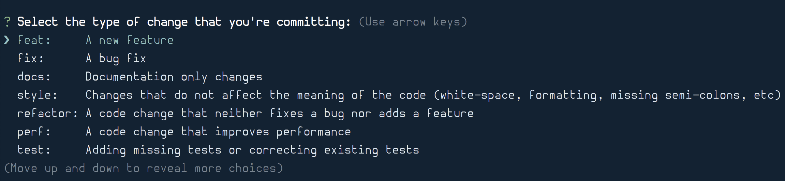
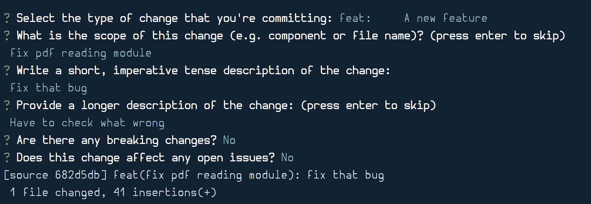

I am always looking for ways to make me a better developer. This includes improving  the coding process and automation of coding tasks. One area I have been improving is my writing of commit messages.

One bad habit one use to take under time constraints is to ignore documentation. Missing documentation is not important until it is, then, it is important.

That's one area I'm trying to improve in. Good commit messages are a most often ignored form of documentation, so how do we improve them?

I became aware of [Conventional Commits](https://www.conventionalcommits.org/en/v1.0.0-beta.3/) thanks to [Enhance your git log with conventional commits](https://dev.to/maxpou/enhance-your-git-log-with-conventional-commits-3ea4). I liked the article and started writing conventional commits by hand for the last couple of days.

I wanted to automate enforcing conventional commit messages in all my projects. I googled and found the tools I needed to set it up globally for all commit messages:

- [Commitizen](https://github.com/commitizen/cz-cli) helps writing the conventional commit message
- [Commitlint](https://github.com/conventional-changelog/commitlint) check each commit for proper format
- [Git global hooks](https://til.hashrocket.com/posts/c89a35a66c-global-git-hooks) fail if the commit message does not follow the standard

### Commitizen

[Commitizen](https://github.com/commitizen/cz-cli) is a handy script that prompts and builds the parts of a conventional commit message.

The first step is to install it: (taken from their README)
```
npm install -g commitizen
```

Install your prefered commitizen adapter globally, for example `cz-conventional-changelog`:

```
npm install -g cz-commitizen-changelog
```

Create a `.czrc` file with the path of the commitizen adapter

```
echo '{ "path": "cz-conventional-changelog" }' > ~/.czrc
```

After Commitizen installs instead of using `git commit`, you create a commit using `git cz`.

First it will ask for the type of commit:



Then it will ask for a commit subject, description, breaking changes and open issues:



Now that the commit is ready we can continue to the next step.

### Commitlint

[Commitlint](https://github.com/conventional-changelog/commitlint) is a tool that will lint your commit message and notify you if it adheres to a standard you've chosen.

Global installation is as easy as Commitizen's. We need to configure some stuff that's not in the README.

Install the CLI and the configuration you want:

```
npm install -g @commitlint/cli @commitlint/config-conventional
```

Create a global config file:

```
echo "module.exports = {extends: ['@commitlint/config-conventional']}" > ~/commitlint.config.js
```

That's all. You can test it to make sure the install is correct:

```
echo 'must fail' | commitlint
```

If you want to see a passing message try:

```
echo 'fix(broken links) fix broken links in homepage'
```

now we are ready to tie all together ...

### Git Hook

Commitlint doesn't do much by it's own, until it's placed in a git hook. From inside this hook we will fail the commit message if it does not follow the standard.

Like with the earlier packages, I wanted to set this up for all my projects without having to go and configure each. so I added a global git hook. (Topic for a later post)

I had global git hooks set up, so I added a `commit-msg` file with a simple script. This script compares it with commitlint, and fails if the message is not following the rules:

```
#!/bin/bash

cat $1 | commitlint
```

### Conclusion

This three easy steps will enable Conventional Commit in your workflow. You will gain the most from them if you have the habit of creating **atomical commits**. The beauty of this workflow will be more clear when you have been using it for a while. Do a `git log --one-line` and see the beautiful list of commit full of context.
