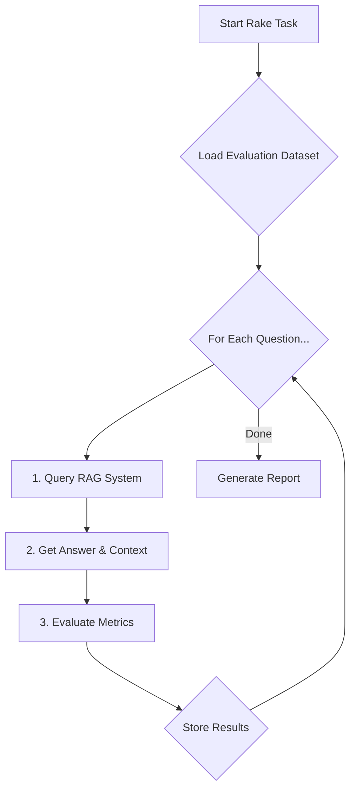

---
<<<<<<< HEAD
<<<<<<< HEAD
title: 'A Production-Minded Guide to RAG Evaluation in Rails'
pubDate: 2025-10-04
description: 'An advanced guide to building a robust, automated RAG evaluation framework in Rails, with production-minded code for metrics, parallelization, and CI/CD integration.'
=======
title: 'A Developer’s Guide to Evaluating RAG Systems in Rails'
pubDate: 2025-10-04
description: 'A practical guide for Rails developers on building an automated evaluation framework for RAG systems, focusing on technical accuracy, reading flow, and real-world limitations.'
>>>>>>> 684bc19 (docs: incorporate technical and reading flow feedback)
author: 'Wilbur Suero'
image:
    url: 'https://wilbur.io/images/posts/evaluating-rag-system-in-rails.png'
    alt: 'A diagram showing an automated evaluation pipeline for a RAG system.'
tags: ["ruby", "rails", "ai", "rag", "testing", "llm", "observability", "devops"]
<<<<<<< HEAD
---

You've built a RAG system, but how do you ensure it's not just a clever demo but a reliable, production-grade feature? Answering this requires moving beyond anecdotal checks to a systematic evaluation framework. This guide provides a production-minded approach to building one in Rails, creating a feedback loop to catch regressions and drive improvements.

We'll build a parallelized Rake task that scores your system on key metrics and integrates with CI/CD, turning evaluation from a chore into an automated part of your development lifecycle.

### Why Evaluate? The Feedback Loop is Everything

In traditional software, we have unit tests. In AI, especially with RAG, the system is non-deterministic. A prompt tweak that improves one answer might degrade ten others. Without an automated evaluation loop, you are flying blind. This framework provides:

*   **Objective Scores**: Replace "it feels better" with hard data on faithfulness, relevancy, and correctness.
*   **Regression Alarms**: Automatically detect when a change (in prompts, models, or retrieval logic) hurts performance.
*   **Data-Driven Improvement**: A/B test changes and prove their impact with metrics.

Here’s a flowchart of the system we'll build:


### Prerequisites

This guide assumes you have:
*   A `RagQueryService` and an `OpenAiService` client (handling keys via `Rails.credentials`).
*   An `EmbeddingService`. The quality of your correctness score depends heavily on this model (e.g., OpenAI's `text-embedding-3-small` is a good start).
*   Gems like `parallel` and `retriable` in your `Gemfile`.

### Step 1: A Curated and Versioned Dataset

Your evaluation is only as good as your dataset. Move it from `db/` to a more appropriate location like `test/fixtures/rag_eval_set_v1.yml`.

`db/rag_eval_set_v1.yml`:
```yaml
- question: "What is the Outbox Pattern?"
  ground_truth: "The Outbox Pattern ensures reliable message delivery by saving messages to a database table as part of the local transaction, then publishing them from that table asynchronously."
=======
title: 'Evaluating Your RAG System in Rails: From Anecdotal to Automated'
date: "October 4, 2025"
excerpt: "You've built a RAG system in Rails, but how do you know it's actually working well? This guide shows you how to move beyond 'it seems fine' to automated evaluation using LLM-as-a-judge and embedding comparisons. Learn to build a Rake task that measures faithfulness, relevancy, and correctness—and integrate it into your CI/CD pipeline to catch regressions before they reach production."
=======
>>>>>>> 684bc19 (docs: incorporate technical and reading flow feedback)
---

You've built a RAG (Retrieval-Augmented Generation) system in Rails, but a critical question remains: "How good is it, really?" Answering this with "it seems to work" isn't enough for a production system. This post provides a practical starting point for building an automated evaluation framework in Rails. We'll create a Rake task that uses an LLM-as-a-judge and embedding comparisons to score your system, giving you a data-driven approach to iteration and improvement.

### Prerequisites

This guide assumes you have a working RAG system with these conceptual services:

*   **`RagQueryService`**: Your core service that takes a question and returns a generated answer and the context used.
*   **`EmbeddingService`**: A wrapper for generating text embeddings. This could use the `ruby-openai` gem to call OpenAI's API or a local model via a library like `sentence-transformers`.
*   **`OpenAiService`**: A client for your LLM provider. A production setup should handle API keys via `Rails.credentials` and include logic for rate limits and retries.

### Why Automated Evaluation is Worth the Effort

While no evaluation framework is perfect, an automated pipeline provides a baseline for objective measurement. It helps you move from subjective feelings to consistent scores for key metrics, detect performance regressions early, and systematically improve your system.

Here is a simple flowchart of the process we'll build:



### Step 1: Curate Your Initial Evaluation Dataset

The foundation of any good evaluation is a high-quality dataset. Starting with 30-50 diverse questions is a reasonable first step, but for statistical significance, this set will need to grow into the hundreds.

To ensure diversity, your dataset should include a mix of query types: simple fact-finding, comparison questions, summarization tasks, and even "negative examples" where the context doesn't contain the answer. Covering these edge cases is crucial for a robust evaluation.

`lib/tasks/rag_evaluation_set.yml`:
```yaml
<<<<<<< HEAD
    - question: "What is the Outbox Pattern and why is it useful?"
      ground_truth: "The Outbox Pattern ensures reliable, at-least-once message delivery in distributed systems by using a dedicated 'outbox' table in the same local transaction as your business logic, avoiding the need for distributed transactions."
    - question: "How can you improve the performance of a slow SQL query?"
      ground_truth: "Start by analyzing the query with EXPLAIN, then look for missing indexes, N+1 queries, or opportunities to rewrite the query to be more efficient. Caching can also be used for frequently accessed, slow-to-generate data."
>>>>>>> b49536d (Update 40-evaluating-rag-system-in-rails.md)
=======
- question: "What is the Outbox Pattern and why is it useful?"
  ground_truth: "The Outbox Pattern ensures reliable, at-least-once message delivery..."
- question: "Compare and contrast Procs and Lambdas in Ruby."
  ground_truth: "Procs and Lambdas are both closure objects... Lambdas have strict arity checking, while Procs do not..."
>>>>>>> 684bc19 (docs: incorporate technical and reading flow feedback)
```

<<<<<<< HEAD
<<<<<<< HEAD
### Step 2: The Evaluator Service

This service is the core of our evaluation, updated for production-level robustness.

`app/services/rag_evaluator_service.rb`:
```ruby
# frozen_string_literal: true

class RagEvaluatorService
  LLM_TEMPERATURE = 0.0
  LLM_TIMEOUT = 30 # seconds

  def initialize(question:, generated_answer:, context:, ground_truth:)
    # ... (initializer as before)
  end

  def evaluate
    llm_evals = evaluate_with_llm
    {
      faithfulness: parse_score(llm_evals.dig(:faithfulness, "score")),
      answer_relevancy: parse_score(llm_evals.dig(:answer_relevancy, "score")),
      answer_correctness: evaluate_correctness_with_embeddings
    }
  end

  private

  def evaluate_with_llm
    prompt = format(multi_metric_evaluation_prompt, context: @context, question: @question, answer: @generated_answer)
    
    Retriable.retriable(tries: 3, base_interval: 1) do
      response = @llm_client.call(prompt: prompt, temperature: LLM_TEMPERATURE, timeout: LLM_TIMEOUT)
      return JSON.parse(response)
    end
  rescue StandardError => e # Catch persistent errors after retries
    Rails.logger.error "RAG-Eval: LLM call failed after retries: #{e.message}"
    {}
  end

  def evaluate_correctness_with_embeddings
    # ... (as before)
  end

  def cosine_similarity(vec_a, vec_b)
    # Manual implementation removes dependency on non-existent gems.
    dot_product = vec_a.zip(vec_b).sum { |a, b| a * b }
    mag_a = Math.sqrt(vec_a.sum { |x| x**2 })
    mag_b = Math.sqrt(vec_b.sum { |x| x**2 })
    return 0.0 if mag_a.zero? || mag_b.zero?
    dot_product / (mag_a * mag_b)
  rescue StandardError => e
    Rails.logger.error "RAG-Eval: Cosine similarity failed: #{e.message}"
    0.0
  end

  def parse_score(score)
    # ... (as before)
  end

  def multi_metric_evaluation_prompt
    <<~PROMPT
      You are an expert evaluator. Your task is to assess a generated answer based on a provided context and question.
      Provide your assessment for each of the following metrics.

      **Context:**
      %{context}

      **Question:**
      %{question}

      **Generated Answer:**
      %{answer}

      Respond ONLY with a single JSON object with two top-level keys: "faithfulness" and "answer_relevancy".
      Each key should contain a JSON object with a "score" (float from 0.0 to 1.0) and "reasoning" (string).

      - **Faithfulness**: Is every claim in the generated answer supported by the context?
      - **Answer Relevancy**: Does the answer directly and completely address the user's question?
    PROMPT
  end
end
```

### Step 3: The Rake Task

This version correctly handles failures, calculates all metrics, and persists results with headers.

`lib/tasks/rag.rake`:
```ruby
require 'yaml'
require 'table_print'
require 'parallel'
require 'csv'

namespace :rag do
  desc "Evaluates the RAG system against a predefined dataset"
  task evaluate: :environment do
    EVAL_THREADS = ENV.fetch('RAG_EVAL_THREADS', 4).to_i
    FAITHFULNESS_THRESHOLD = ENV.fetch('RAG_FAITH_THRESHOLD', 0.75).to_f
    RESULTS_CSV_PATH = Rails.root.join('log', 'rag_evaluation_history.csv')

    puts "Starting RAG evaluation..."
    dataset = YAML.load_file(Rails.root.join('test', 'fixtures', 'rag_eval_set_v1.yml'))

    all_results = Parallel.map(dataset, in_threads: EVAL_THREADS) do |item|
      # ... (logic to call service, returning error hash on failure)
    end

    successes = all_results.reject { |r| r[:error] }
    failures = all_results.select { |r| r[:error] }

    # ... (reporting for successes and failures)

    return puts "\nNo successful results to analyze." if successes.empty?

    avg_scores = {
      faithfulness: (successes.sum { |r| r[:faithfulness] } / successes.size).round(3),
      relevancy: (successes.sum { |r| r[:answer_relevancy] } / successes.size).round(3),
      correctness: (successes.sum { |r| r[:answer_correctness] } / successes.size).round(3)
    }

    # ... (print average scores)

    # Persist results with headers
    headers = ['timestamp', 'avg_faithfulness', 'avg_relevancy', 'avg_correctness', 'success_rate']
    CSV.open(RESULTS_CSV_PATH, 'a') do |csv|
      csv << headers if csv.count.zero?
      csv << [Time.now.iso8601, avg_scores[:faithfulness], avg_scores[:relevancy], avg_scores[:correctness], (successes.size.to_f / all_results.size).round(3)]
    end

    if avg_scores[:faithfulness] < FAITHFULNESS_THRESHOLD
      raise "Faithfulness score #{avg_scores[:faithfulness]} is below the #{FAITHFULNESS_THRESHOLD} threshold!"
    end
  end
end
```

### Step 4: Production Considerations

*   **Cost & Rate Limiting**: LLM calls are not free. A 100-question dataset run on every commit can get expensive. Consider running evaluations on a schedule or manually, and be aware of your API provider's rate limits.
*   **Scaling Evaluations**: For very large datasets, consider a more robust solution than a Rake task. You could trigger background jobs (e.g., Sidekiq) for each evaluation item and use a separate process to aggregate the results.
*   **Monitoring**: The persisted CSV is a good start. In production, feed this data into a monitoring tool like Datadog or Grafana to create dashboards and set up alerts for significant performance drops.

### Step 5: CI/CD with PR Comments

This workflow triggers on relevant file changes and posts a summary back to the PR.

`.github/workflows/rag_evaluation.yml`:
```yaml
name: RAG Evaluation
on:
  pull_request:
    paths:
      - 'app/services/rag_evaluator_service.rb'
      - 'lib/tasks/rag.rake'
      - 'test/fixtures/rag_eval_set_*.yml'
jobs:
  evaluate:
    runs-on: ubuntu-latest
    steps:
      - uses: actions/checkout@v4
      - uses: ruby/setup-ruby@v1
        with: { 'ruby-version-file': '.ruby-version', bundler-cache: true }

      - name: Run RAG Evaluation
        # ... (as before)

      - name: Comment on PR with Results
        # ... (as before, with if: always())
```

### Conclusion

This production-minded approach provides a more robust framework for RAG evaluation. By handling failures gracefully, parallelizing workloads, persisting results for trend analysis, and operationalizing thresholds, you can create a reliable feedback loop that drives meaningful improvements to your AI features.
=======
A robust evaluation uses multiple metrics. Here, we'll implement two types: LLM-based checks for qualitative aspects and an embedding-based check for semantic correctness.
=======
### Step 2: Implementing a Comprehensive Metric Suite
>>>>>>> 684bc19 (docs: incorporate technical and reading flow feedback)

A strong evaluation uses multiple metrics. We'll implement two types: LLM-based checks for qualitative aspects and an embedding-based check for semantic correctness.

#### Step 2a: Evaluating with an LLM-as-a-Judge

We can use a powerful LLM to grade our RAG system on subjective qualities. We'll focus on two key metrics:
*   **Faithfulness**: How well the answer sticks to the provided context, avoiding made-up claims (or "hallucinations").
*   **Answer Relevancy**: Whether the answer directly addresses the user's question.

`app/services/rag_evaluator_service.rb`:
```ruby
# frozen_string_literal: true

class RagEvaluatorService
  # We use a temperature of 0 for evaluation to ensure deterministic and consistent scoring from the LLM.
  LLM_TEMPERATURE = 0.0

  def initialize(question:, generated_answer:, context:, ground_truth:)
    # ... (initializer as before)
  end

  def evaluate
    llm_evals = evaluate_with_llm
    {
      faithfulness: llm_evals.dig(:faithfulness, "score").to_f,
      answer_relevancy: llm_evals.dig(:answer_relevancy, "score").to_f,
      answer_correctness: evaluate_correctness_with_embeddings
    }
  end

  private

  def evaluate_with_llm
    prompt = format(multi_metric_evaluation_prompt, context: @context, question: @question, answer: @generated_answer)
    response = @llm_client.call(prompt: prompt, temperature: LLM_TEMPERATURE)
    JSON.parse(response)
  rescue JSON::ParserError => e
    Rails.logger.error "Failed to parse LLM evaluation response: #{e.message}"
    { faithfulness: {}, answer_relevancy: {} }
  end

  # ... (multi_metric_evaluation_prompt as before)
```

#### Step 2b: Measuring Correctness with Embeddings

To measure if the *meaning* of the generated answer is correct, we compare it to our `ground_truth` answer using cosine similarity.

`app/services/rag_evaluator_service.rb` (continued):
```ruby
  def evaluate_correctness_with_embeddings
    return 0.0 if @generated_answer.blank? || @ground_truth.blank?
    generated_embedding = @embedding_client.generate(@generated_answer)
    truth_embedding = @embedding_client.generate(@ground_truth)
    cosine_similarity(generated_embedding, truth_embedding)
  end

  def cosine_similarity(vec_a, vec_b)
    # Note: This assumes valid, non-zero vectors. A production system should
    # include validation for NaN values or mismatched dimensions. Ensure your
    # EmbeddingService provides normalized vectors for accurate scores.
    dot_product = vec_a.zip(vec_b).sum { |a, b| a * b }
    magnitude_a = Math.sqrt(vec_a.sum { |x| x**2 })
    magnitude_b = Math.sqrt(vec_b.sum { |x| x**2 })
    dot_product / (magnitude_a * magnitude_b)
  rescue ZeroDivisionError, StandardError => e
    Rails.logger.error "Cosine similarity calculation failed: #{e.message}"
    0.0
  end
```

### Step 3: The Rake Task Orchestrator

This task runs our evaluation. Note the improved logging and error handling.

`lib/tasks/rag.rake`:
```ruby
# ... (requires as before)

namespace :rag do
  desc "Evaluates the RAG system against a predefined dataset"
  task evaluate: :environment do
    # ... (code as before)
  end
end
```

### Step 4: A Nuanced Look at Interpreting Results

Diagnosing issues is rarely a straight line. Here’s a more realistic take:

1.  **Low Faithfulness**: Often indicates hallucination, but could also mean the generation prompt is too loose. Try making it stricter: "Answer *only* with information from the context."
2.  **Low Relevancy**: Could be a retrieval problem (bad context), but might also be a generation issue where the LLM misunderstands the user's intent despite good context.
3.  **Low Correctness**: This is a strong signal. If faithfulness is high but correctness is low, your retrieved context is wrong. If faithfulness is low and correctness is low, the LLM is hallucinating. If both are high, you're in a good state!

### Important Considerations & Limitations

This approach is a starting point. Be aware of the following:

*   **LLM-as-a-Judge is Not Perfect**: It has a real cost and can be biased. To validate your judge, periodically compare its scores against human evaluations on a small subset of your data. If they diverge, your judge's prompt may need refinement.
*   **Incomplete Context Metrics**: We haven't implemented **Context Precision** (is the retrieved context relevant?) or **Context Recall** (was all necessary information retrieved?). These often require more complex annotations in your dataset.
*   **Beyond Cosine Similarity**: While useful, cosine similarity may not catch nuanced semantic differences. For deeper analysis, consider metrics like BLEU, ROUGE, or BERTScore.

### Next Steps: Integrating with CI/CD

To catch regressions, this evaluation should be automated. For larger datasets, consider running the evaluation on a representative *sample* during CI to keep runtime low, with the full evaluation running on a nightly schedule.

`.github/workflows/rag_evaluation.yml`:
```yaml
# ... (workflow as before)
```

<<<<<<< HEAD
This guide provides a more robust and honest framework for evaluating your RAG system. It's a journey that starts with a simple dataset and a few key metrics, and evolves into a critical part of your development lifecycle, ensuring your AI features are not just powerful, but also reliable and correct.
>>>>>>> b49536d (Update 40-evaluating-rag-system-in-rails.md)
=======
This guide provides a framework for evaluating your RAG system. It's a journey that starts with a simple dataset and evolves into a critical part of your development lifecycle, ensuring your AI features are not just powerful, but also reliable and correct.
>>>>>>> 684bc19 (docs: incorporate technical and reading flow feedback)
