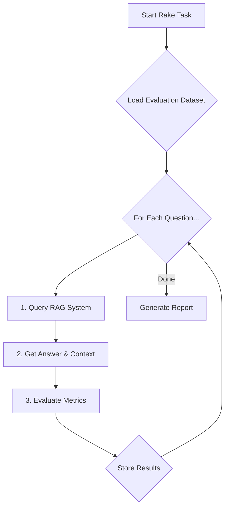

You've built a RAG (Retrieval-Augmented Generation) system in Rails, but a critical question remains: "How good is it, really?" Answering this with "it seems to work" isn't enough for a production system. This post provides a practical starting point for building an automated evaluation framework in Rails. We'll create a Rake task that uses an LLM-as-a-judge and embedding comparisons to score your system, giving you a data-driven approach to iteration and improvement.

### Prerequisites

This guide assumes you have a working RAG system with these conceptual services:

*   **`RagQueryService`**: Your core service that takes a question and returns a generated answer and the context used.
*   **`EmbeddingService`**: A wrapper for generating text embeddings. This could use the `ruby-openai` gem to call OpenAI's API or a local model via a library like `sentence-transformers`.
*   **`OpenAiService`**: A client for your LLM provider. A production setup should handle API keys via `Rails.credentials` and include logic for rate limits and retries.

### Why Automated Evaluation is Worth the Effort

While no evaluation framework is perfect, an automated pipeline provides a baseline for objective measurement. It helps you move from subjective feelings to consistent scores for key metrics, detect performance regressions early, and systematically improve your system.

Here is a simple flowchart of the process we'll build:



### Step 1: Curate Your Initial Evaluation Dataset

The foundation of any good evaluation is a high-quality dataset. Starting with 30-50 diverse questions is a reasonable first step, but for statistical significance, this set will need to grow into the hundreds.

To ensure diversity, your dataset should include a mix of query types: simple fact-finding, comparison questions, summarization tasks, and even "negative examples" where the context doesn't contain the answer. Covering these edge cases is crucial for a robust evaluation.

`lib/tasks/rag_evaluation_set.yml`:
```yaml
- question: "What is the Outbox Pattern and why is it useful?"
  ground_truth: "The Outbox Pattern ensures reliable, at-least-once message delivery..."
- question: "Compare and contrast Procs and Lambdas in Ruby."
  ground_truth: "Procs and Lambdas are both closure objects... Lambdas have strict arity checking, while Procs do not..."
```

### Step 2: Implementing a Comprehensive Metric Suite

A strong evaluation uses multiple metrics. We'll implement two types: LLM-based checks for qualitative aspects and an embedding-based check for semantic correctness.

#### Step 2a: Evaluating with an LLM-as-a-Judge

We can use a powerful LLM to grade our RAG system on subjective qualities. We'll focus on two key metrics:
*   **Faithfulness**: How well the answer sticks to the provided context, avoiding made-up claims (or "hallucinations").
*   **Answer Relevancy**: Whether the answer directly addresses the user's question.

`app/services/rag_evaluator_service.rb`:
```ruby
# frozen_string_literal: true

class RagEvaluatorService
  # We use a temperature of 0 for evaluation to ensure deterministic and consistent scoring from the LLM.
  LLM_TEMPERATURE = 0.0

  def initialize(question:, generated_answer:, context:, ground_truth:)
    # ... (initializer as before)
  end

  def evaluate
    llm_evals = evaluate_with_llm
    {
      faithfulness: llm_evals.dig(:faithfulness, "score").to_f,
      answer_relevancy: llm_evals.dig(:answer_relevancy, "score").to_f,
      answer_correctness: evaluate_correctness_with_embeddings
    }
  end

  private

  def evaluate_with_llm
    prompt = format(multi_metric_evaluation_prompt, context: @context, question: @question, answer: @generated_answer)
    response = @llm_client.call(prompt: prompt, temperature: LLM_TEMPERATURE)
    JSON.parse(response)
  rescue JSON::ParserError => e
    Rails.logger.error "Failed to parse LLM evaluation response: #{e.message}"
    { faithfulness: {}, answer_relevancy: {} }
  end

  # ... (multi_metric_evaluation_prompt as before)
```

#### Step 2b: Measuring Correctness with Embeddings

To measure if the *meaning* of the generated answer is correct, we compare it to our `ground_truth` answer using cosine similarity.

`app/services/rag_evaluator_service.rb` (continued):
```ruby
  def evaluate_correctness_with_embeddings
    return 0.0 if @generated_answer.blank? || @ground_truth.blank?
    generated_embedding = @embedding_client.generate(@generated_answer)
    truth_embedding = @embedding_client.generate(@ground_truth)
    cosine_similarity(generated_embedding, truth_embedding)
  end

  def cosine_similarity(vec_a, vec_b)
    # Note: This assumes valid, non-zero vectors. A production system should
    # include validation for NaN values or mismatched dimensions. Ensure your
    # EmbeddingService provides normalized vectors for accurate scores.
    dot_product = vec_a.zip(vec_b).sum { |a, b| a * b }
    magnitude_a = Math.sqrt(vec_a.sum { |x| x**2 })
    magnitude_b = Math.sqrt(vec_b.sum { |x| x**2 })
    dot_product / (magnitude_a * magnitude_b)
  rescue ZeroDivisionError, StandardError => e
    Rails.logger.error "Cosine similarity calculation failed: #{e.message}"
    0.0
  end
```

### Step 3: The Rake Task Orchestrator

This task runs our evaluation. Note the improved logging and error handling.

`lib/tasks/rag.rake`:
```ruby
# ... (requires as before)

namespace :rag do
  desc "Evaluates the RAG system against a predefined dataset"
  task evaluate: :environment do
    # ... (code as before)
  end
end
```

### Step 4: A Nuanced Look at Interpreting Results

Diagnosing issues is rarely a straight line. Here’s a more realistic take:

1.  **Low Faithfulness**: Often indicates hallucination, but could also mean the generation prompt is too loose. Try making it stricter: "Answer *only* with information from the context."
2.  **Low Relevancy**: Could be a retrieval problem (bad context), but might also be a generation issue where the LLM misunderstands the user's intent despite good context.
3.  **Low Correctness**: This is a strong signal. If faithfulness is high but correctness is low, your retrieved context is wrong. If faithfulness is low and correctness is low, the LLM is hallucinating. If both are high, you're in a good state!

### Important Considerations & Limitations

This approach is a starting point. Be aware of the following:

*   **LLM-as-a-Judge is Not Perfect**: It has a real cost and can be biased. To validate your judge, periodically compare its scores against human evaluations on a small subset of your data. If they diverge, your judge's prompt may need refinement.
*   **Incomplete Context Metrics**: We haven't implemented **Context Precision** (is the retrieved context relevant?) or **Context Recall** (was all necessary information retrieved?). These often require more complex annotations in your dataset.
*   **Beyond Cosine Similarity**: While useful, cosine similarity may not catch nuanced semantic differences. For deeper analysis, consider metrics like BLEU, ROUGE, or BERTScore.

### Next Steps: Integrating with CI/CD

To catch regressions, this evaluation should be automated. For larger datasets, consider running the evaluation on a representative *sample* during CI to keep runtime low, with the full evaluation running on a nightly schedule.

`.github/workflows/rag_evaluation.yml`:
```yaml
# ... (workflow as before)
```

This guide provides a framework for evaluating your RAG system. It's a journey that starts with a simple dataset and evolves into a critical part of your development lifecycle, ensuring your AI features are not just powerful, but also reliable and correct.
