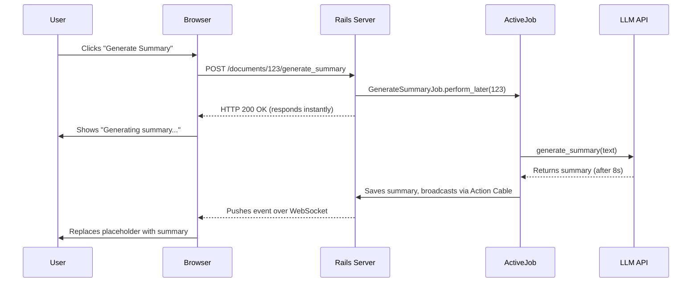

**TL;DR:** Synchronous LLM calls are slow (5-10s). For a responsive UI, use background jobs with real-time updates (Pattern 1). For read-heavy shared data, use intelligent caching (Pattern 2). For critical features, proactively warm the cache (Pattern 3). This post shows you how to implement these patterns robustly.

### The Baseline Problem: The 8-Second Spinner

You ship a new AI summary feature. The implementation is simple: a controller action calls `OpenAiService` directly. Then the feedback rolls in: "It's too slow." A direct API call can take 5-10 seconds—an eternity for a user staring at a spinner. A p95 response time of 8s is unacceptable. In our testing, Pattern 1 reduced perceived latency to ~200ms (the time for the server to respond and the UI to update), while Patterns 2 and 3 achieved a p95 of **<50ms**. Here’s how.

### The Patterns at a Glance

| Pattern                                | Pros                                        | Cons                                                                 | Best For                                                                     |
| -------------------------------------- | ------------------------------------------- | -------------------------------------------------------------------- | ---------------------------------------------------------------------------- |
| **1. Async Job + Real-time Updates**   | Excellent UX, non-blocking.                 | High architectural complexity (Action Cable, state management).      | Unique, user-specific content (custom reports, personalized emails).         |
| **2. Proactive Caching**               | Fastest reads, simple to implement.         | Synchronous wait on cache miss. Stale data risk if keys are wrong.   | Shared, read-heavy content (product descriptions, public summaries).         |
| **3. Hybrid: Proactive Cache Warming** | Best of both: instant reads, responsive UI. | Combines complexity of both. Wastes resources if content isn't read. | Mission-critical features where speed is paramount (dashboards, onboarding). |

---

### Pattern 1: The Asynchronous Job with Real-time Updates

This pattern offloads the slow API call to a background job and uses Action Cable to notify the user when the result is ready. Note that Action Cable is just one approach; you could also use polling for a simpler, lower-tech solution.



**The Backend Implementation:**

`app/models/document.rb`

```ruby
class Document < ApplicationRecord
  lock_optimistically
  enum summary_status: { pending: 0, processing: 1, complete: 2, failed: 3 }
end
```

`app/jobs/generate_summary_job.rb`

```ruby
class GenerateSummaryJob < ApplicationJob
  # User is waiting, so this is higher priority than batch jobs
  queue_as :default
  retry_on StandardError, wait: :exponentially_longer, attempts: 5

  def perform(document_id)
    document = Document.find(document_id)
    document.processing!

    summary = OpenAiService.generate_summary(document.text)
    document.update!(summary: summary, summary_status: :complete)

    DocumentChannel.broadcast_to(document, { status: 'complete', summary: summary })

  # Handle race conditions where the document was updated during the job
  rescue ActiveRecord::StaleObjectError => e
    Rails.logger.warn "Stale object during summary generation: #{e.message}"
    raise # Let ActiveJob's retry mechanism handle it
  rescue StandardError => e
    document.failed!
    DocumentChannel.broadcast_to(document, { status: 'failed', error: e.message })
    Rails.logger.error "Failed to generate summary for #{document_id}: #{e.message}"
  end
end
```

**The Frontend (with Security):**

Your Action Cable channel **must** authorize the subscription. Otherwise, any user could listen in on any document's updates.

`app/channels/application_cable/connection.rb`

```ruby
module ApplicationCable
  class Connection < ActionCable::Connection::Base
    identified_by :current_user

    def connect
      self.current_user = find_verified_user
    end

    private
      def find_verified_user
        # Assumes you use Devise or a similar warden-based auth
        if verified_user = env['warden'].user
          verified_user
        else
          reject_unauthorized_connection
        end
      end
  end
end
```

`app/channels/document_channel.rb`

```ruby
class DocumentChannel < ApplicationCable::Channel
  def subscribed
    document = Document.find(params[:id])
    # SECURITY: Reject if the user is not authorized to view the document
    reject unless current_user.can_view?(document)
    stream_for document
  end
end
```

---

### Pattern 2: Proactive Caching with Robust Keys

For data that is expensive to generate but frequently read, caching is essential.

**The UX Caveat:** This pattern is simple, but if a user requests a summary and it's not in the cache (a "cache miss"), they will wait the full 5-10 seconds for the synchronous API call. This is only acceptable for scenarios where an occasional long wait is okay, or when you can nearly guarantee the cache is always warm.

`app/services/summary_service.rb`

```ruby
class SummaryService
  PROMPT_VERSION = "v1.3"

  def self.get_for(document)
    cache_key = [document.cache_key_with_version, "summary", PROMPT_VERSION]

    Rails.cache.fetch(cache_key, expires_in: 7.days) do
      # This block only runs on a cache miss
      OpenAiService.generate_summary(document.text)
    end
  end
end
```

---

### The Hybrid Approach: Proactive Cache Warming

This combines both patterns: enqueue a background job to warm the cache when a document changes.

`app/jobs/warm_summary_cache_job.rb`

```ruby
class WarmSummaryCacheJob < ApplicationJob
  # No user is waiting, so this can be a lower priority
  queue_as :low_priority

  def perform(document_id)
    document = Document.find(document_id)
    SummaryService.get_for(document)
  end
end
```

**The Cold Start Problem:** Be aware that if a user requests a summary _after_ the warming job is enqueued but _before_ it completes, they will still experience a cache miss and have to wait.

---

### Production-Hardening Your System

- **Queue Prioritization:** User-initiated jobs (Pattern 1) that a user is actively waiting for should run in a high-priority queue (`:default` or `:high`). Background warming jobs (Pattern 3) where no one is waiting should run in a `:low_priority` queue so they don't block password resets or other critical tasks.

- **Cost Analysis:** Caching prevents _redundant_ API calls. Without it, 1,000 users viewing the same popular document means 1,000 API calls (e.g., $10). With caching, it's 1 API call + 999 cache hits (total cost: $0.01). Pattern 3 has a different model: you pay to generate a summary for _every_ new document, but you save money by preventing multiple generations for popular ones.

- **Monitoring & Observability:** Don't fly blind. _How_ do you track cache performance?
  1.  **Instrument Your Code:** Use `ActiveSupport::Notifications` or a simple wrapper to send data to StatsD or another metrics service.
      ```ruby
      # config/initializers/cache_monitoring.rb
      module CacheMonitoring
        def fetch(key, **options, &block)
          hit = exist?(key)
          ::StatsD.increment("cache.#{key.first}.#{hit ? 'hit' : 'miss'}")
          super
        end
      end
      Rails.cache.singleton_class.prepend(CacheMonitoring)
      ```
  2.  **Use APM Tools:** Services like Scout APM, Skylight, or New Relic often provide cache performance monitoring out of the box.
  3.  **Check Redis Directly:** The `redis-cli INFO` command provides basic hit/miss stats.

- **Progressive Enhancement:** What if Action Cable disconnects? Your feature should degrade gracefully. Provide a "Check for updates" button that triggers a poll to the server, or fall back to a simple page reload.

### Conclusion

Moving from a synchronous request to a system that feels instantaneous requires architectural discipline. By choosing the right pattern for your use case—balancing user experience, complexity, and cost—you can build AI features in Rails that are fast, reliable, and production-ready.
