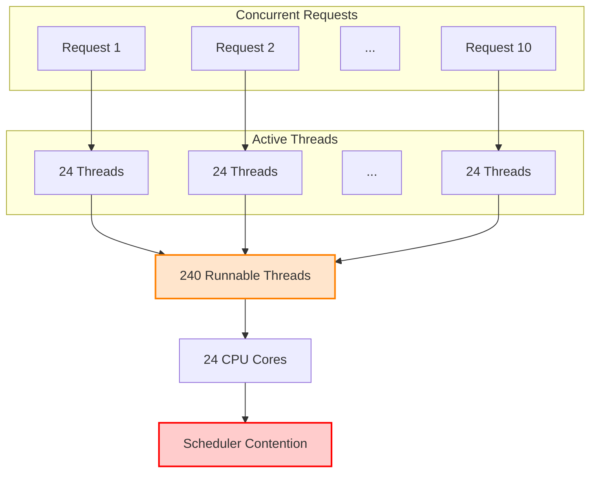
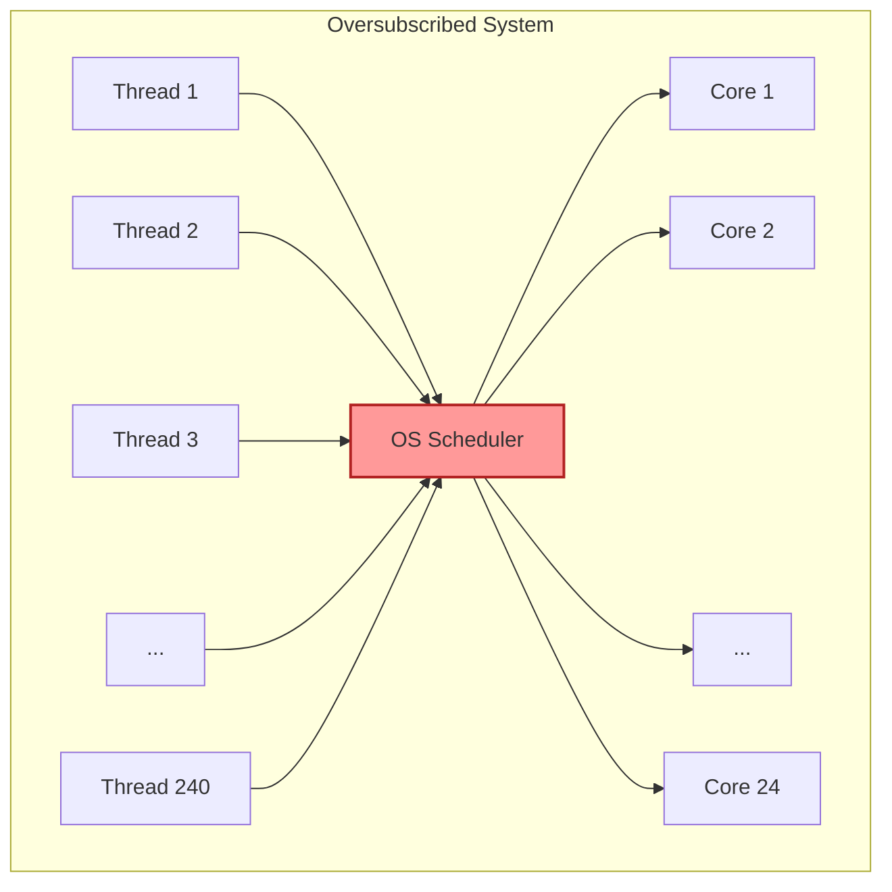

Our inference server had 24 CPU cores, a mostly idle GPU, and only 10 concurrent requests.

Somehow, average latency exceeded eight seconds.

That shouldn't have been possible.

We were running a Rails background worker system that dispatched embedding and classification requests to an internal Python inference service. As our background queue grew, we did what any sensible team would do: we increased the concurrency of our background workers and scaled up the inference web server.

Instead of seeing our throughput scale linearly, the system ground to a halt. Latency spiked from milliseconds to over eight seconds, background queues backed up, and our server's CPU utilization pegged at 100%. Yet, looking at the GPU telemetry, it was practically idling, waiting for work.

The CPUs weren't spending their time multiplying matrices. They were spending it deciding which thread should run next. As we dug deeper, we realized we were victims of a hidden performance killer: **thread oversubscription**.

---

## The Benchmark That Didn't Make Sense

To diagnose the bottleneck, we isolated the inference service and ran a controlled load test. We simulated a modest concurrency of 10 concurrent requests, sending a total of 100 API requests to the Python inference server.

While an individual, isolated inference request took around 912 milliseconds, putting a concurrent load of just 10 requests pushed the average response time out to over 8 seconds. Even worse, the CPU cores were completely saturated, but the GPU was only at 15% utilization.

In a healthy system, if the CPU is at 100%, throughput should be maximized. But here, the CPU was working incredibly hard to produce almost no output.

Here is what the initial baseline benchmark looked like:

| Metric              |   Baseline |
| :------------------ | ---------: |
| **Throughput**      | 7.28 req/s |
| **Average Latency** |     8.43 s |
| **Inference Time**  |     912 ms |
| **Active Threads**  |       ~240 |
| **CPU Utilization** |        98% |

---

## Our Initial Hypotheses

We thought it was:
* **GPU Saturation**: The model was too heavy for our hardware.
* **Insufficient Workers**: We needed to increase Rails concurrency to queue more work.
* **Slow Model**: The embedding algorithm itself was inherently slow.
* **Network Overhead**: The data transfer between Rails and the inference API was lagging.

It turned out to be none of them.

---

## Following the CPU: The 240-Thread Discovery

We jumped onto the inference server during the load test and ran `htop` to see what the CPU was actually doing. What we saw was a wall of red and green bars representing 24 individual CPU cores (48 logical threads) pegged to their absolute limits.

Then we checked the active thread count for the Python inference process:

```bash
# Count the number of lightweight processes (threads) for our service pid
ps -o nlwp -p <PID>
```

The output was **240**.

A single process handling 10 concurrent web requests had spawned 240 active threads. Where did they come from?

Our Python code was simple. It was a standard FastAPI application using Uvicorn. We weren't manually spawning threads. We were just loading a sentence-transformer model using PyTorch and running inference:

```python
# The seemingly innocent endpoint
@app.post("/embed")
def embed(payload: TextPayload):
    # Under the hood, this call is not single-threaded
    embeddings = model.encode(payload.texts)
    return {"embeddings": embeddings.tolist()}
```

The culprit wasn't our application. It was the stack of native libraries underneath it.

---

## Why Native Libraries Lie to You

To understand why 240 threads were running, we have to look at the architectural layers beneath PyTorch. 

When you call `model.encode()` in Python, your request travels down a vertical stack of abstractions before hitting the CPU:

```
                Request
                   │
         FastAPI / Uvicorn
                   │
              PyTorch
                   │
      OpenMP / MKL / BLAS
                   │
            OS Scheduler
                   │
              CPU Cores
```

At the top, we have FastAPI/Uvicorn, which handles concurrent web connections. Beneath it is PyTorch, which coordinates the neural network graph execution. But PyTorch itself doesn't actually perform the core matrix arithmetic (like matrix multiplication). For that, it delegates to low-level, highly optimized native C and C++ math libraries:

* **BLAS (Basic Linear Algebra Subprograms)**: The standardized API specification for low-level vector and matrix operations.
* **OpenBLAS / MKL (Intel Math Kernel Library)**: Concrete, highly optimized implementations of the BLAS API. They use hand-crafted assembly code, CPU vector extensions (like AVX-512), and internal threading to run matrix math at the absolute limits of the physical silicon.
* **OpenMP (Open Multi-Processing)**: The concurrency engine used by these math libraries to split loops and parallelize matrix calculations across multiple threads.

These native libraries were designed for High-Performance Computing (HPC) environments, where a single program runs on a dedicated machine and expects to utilize every core for a single calculation. MKL and OpenMP query the host core count and spawn a worker thread pool matching it. They assume they own the hardware.

While this behavior is perfect for a Jupyter notebook running on a developer's workstation, it is hostile in a web server or background job runner. Web servers scale by handling independent requests concurrently using separate processes or threads.

If Uvicorn or Rails runs 10 workers on our 24-core server, each worker process makes its own PyTorch calls. PyTorch delegates to OpenMP, which independently spawns 24 threads per request. None of the workers are aware of each other.

Repeat this for all 10 concurrent requests, and the math compounding is brutal:

```
10 Concurrent Requests 
  × 24 Threads per Request 
  = 240 Active Threads competing for 24 Physical Cores
```

To visualize the scale of this duplication:



The native libraries lied to us by assuming they were alone. By defaulting to the total core count, they optimized for single-task speed at the expense of multi-task system throughput. Instead of cooperating, the threads began to fight.

---

## The Cost of Concurrency: Scheduler Contention

When you have 240 active threads screaming for time on 24 physical CPU cores, the operating system is forced to step in. The OS scheduler must slice up CPU time and constantly swap threads in and out of the CPU registers.

This is known as **thread oversubscription**, and it introduces a massive overhead called **scheduler contention**.



Every context switch is work the application didn't ask for. The scheduler saves registers, restores another thread's state, and the CPU begins executing a completely different workload. Caches become less effective, memory must be fetched again, and the processor spends less time multiplying matrices and more time preparing to multiply matrices.

When the cache is constantly invalidated, the CPU cores spend most of their time waiting for data to be fetched from main memory (RAM) instead of performing floating-point math. The CPU is "busy," but it is busy managing its own metadata rather than executing your code.

In our case, the scheduler contention was so severe that the overhead of coordinating the 240 threads completely wiped out the benefits of parallelizing the matrix math. Ten requests, each trying to run on 24 threads, took 912ms. If they had run sequentially on a single thread each, they would have finished in a fraction of the time.

---

## The Fix: Global Concurrency Coordination

The solution was counterintuitive but incredibly simple: we had to force the native libraries to stop parallelizing internal operations. We wanted each request to run on exactly **one thread**, allowing the web server's concurrency model (10 worker processes) to match the physical hardware limits.

We added the following configuration to the very top of our application entry point, before any deep learning library was imported:

```python
import os

# Limit OpenMP threads
os.environ["OMP_NUM_THREADS"] = "1"
os.environ["MKL_NUM_THREADS"] = "1"
os.environ["OPENBLAS_NUM_THREADS"] = "1"
os.environ["VECLIB_MAXIMUM_THREADS"] = "1"
os.environ["NUMEXPR_NUM_THREADS"] = "1"

# Force PyTorch to use a single thread for intra-op and inter-op parallelism
import torch
torch.set_num_threads(1)
torch.set_num_interop_threads(1)
```

By setting these variables to `1`, we instructed PyTorch and its underlying math libraries to execute operations sequentially on a single thread per request. 

We then restarted our server and ran the exact same load test of 10 concurrent requests. 

The results were night and day:

| Metric              | Baseline (Default Threads) | Optimized (1 Thread) |         Improvement |
| :------------------ | :------------------------: | :------------------: | ------------------: |
| **Throughput**      |         7.28 req/s         |     11.45 req/s      |            **+57%** |
| **Average Latency** |           8.43 s           |        5.24 s        |            **-38%** |
| **Inference Time**  |           912 ms           |        560 ms        |            **-38%** |
| **Active Threads**  |            ~240            |         ~10          |   **95% Reduction** |
| **CPU Utilization** |            98%             |         45%          | **Slashed in Half** |

By reducing the thread count from 240 to 10, throughput increased by 57%, average latency dropped by nearly 4 seconds, and CPU utilization was cut in half. 

The CPU was no longer thrashing. It spent its cycles executing matrix multiplication instead of shuffling threads in and out of registers.

---

## When Multi-Threaded Math Libraries Are Actually Good

This doesn't mean `OMP_NUM_THREADS=1` is always correct. It is a design decision based entirely on your application's concurrency model.

If you are running an offline batch job, training a model, or running a single-threaded daemon processing one task at a time, you *want* PyTorch to use all available cores. In this scenario (data-level concurrency), letting MKL parallelize the matrix calculations makes your process run as fast as possible.

However, if you are running a web server or background workers processing many independent requests in parallel (request-level concurrency), each process should use exactly `1` thread. The operating system is already parallelizing the work across the cores at the process level. Adding internal library threads only causes them to fight for the scheduler's attention.

If you run both workloads on the same server, you must configure them separately. For example, keep `OMP_NUM_THREADS=1` on your web servers, but allow it to scale to the core count on your batch processing workers.

---

## The Broader Engineering Lesson

Every layer of the stack was trying to optimize itself independently. None of them were wrong. Together, they were inefficient.

Modern web frameworks and background workers are designed to scale by running multiple isolated processes or threads. Native math libraries are also designed to scale by running multiple threads. If you don't coordinate these two layers, they will fight each other for the scheduler's attention.

Systems don't become fast because every component is individually optimized. They become fast when every component cooperates.

Before you scale your servers horizontally or buy larger GPUs, inspect your process thread count. The best performance optimizations don't always come from writing faster code—sometimes they come from simply stopping your libraries from fighting each other.

No magic. Just systems.
