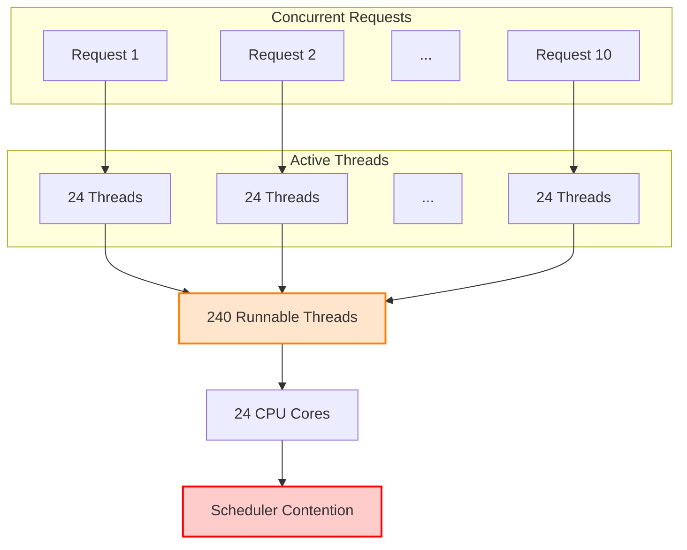
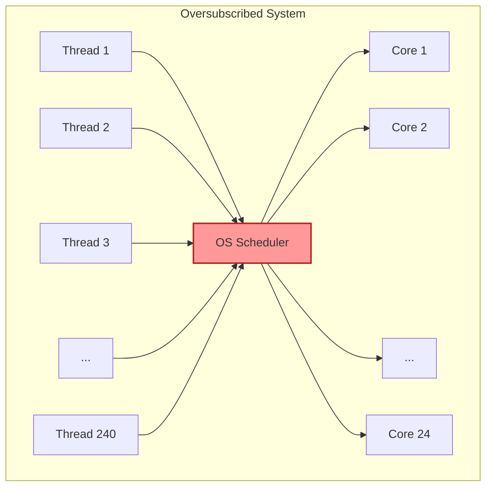

Our inference server had 24 CPU cores, a mostly idle GPU, and only 10 concurrent requests. Yet average latency exceeded eight seconds.

That shouldn't have been possible.

We were running a Rails background worker system that dispatched embedding and classification requests to an internal Python inference service. As our background queue grew, we did what seemed obvious: we increased the concurrency of our background workers and scaled up the inference web server.

Instead of scaling, the system ground to a halt. CPU utilization pegged at 100% while the GPU sat idle. The cores weren't busy multiplying matrices. They were busy deciding which thread to run next. We were thrashing the CPU scheduler.

---

## A benchmark that didn't make sense

To diagnose the bottleneck, we isolated the inference service and ran a controlled load test. We simulated 10 concurrent requests, sending a total of 100 API requests to the Python inference server.

While an individual, isolated request took around 912 milliseconds, a concurrent load of just 10 requests pushed average response times out to over 8 seconds. The CPU cores were completely saturated, but the GPU was only at 15% utilization.

In a healthy system, if the CPU is at 100%, throughput should be maximized. Here, the CPU was working incredibly hard to produce almost no output.

Here is what the initial baseline benchmark looked like:

| Metric              |   Baseline |
| :------------------ | ---------: |
| **Throughput**      | 7.28 req/s |
| **Average Latency** |     8.43 s |
| **Inference Time**  |     912 ms |
| **Active Threads**  |       ~240 |
| **CPU Utilization** |        98% |

---

## The obvious culprits

We initially assumed the model was too heavy for our hardware, or that we needed more Rails workers, or that the network transfer between our Rails app and the Python API was lagging. It was none of these.

---

## Hunting the 240-thread leak

We ran `htop` on the server during the load test. All 24 CPU cores (48 logical threads) were pegged to their limits.

Then we checked the active thread count for the Python process:

```bash
# Count the number of lightweight processes (threads) for our service pid
ps -o nlwp -p <PID>
```

The output was **240**.

A single process handling 10 concurrent requests had spawned 240 active threads. 

Our Python code was simple: a standard FastAPI application using Uvicorn. We weren't manually spawning threads. We were just loading a sentence-transformer model and running inference:

```python
# The seemingly innocent endpoint
@app.post("/embed")
def embed(payload: TextPayload):
    # Under the hood, this call is not single-threaded
    embeddings = model.encode(payload.texts)
    return {"embeddings": embeddings.tolist()}
```

The culprit wasn't our application. It was the stack of native libraries underneath it.

---

## Why native libraries lie to you

When you call `model.encode()`, your request travels down a stack of abstractions before hitting the CPU:

```
                Request
                   │
         FastAPI / Uvicorn
                   │
               PyTorch
                   │
       OpenMP / MKL / BLAS
                   │
             OS Scheduler
                   │
               CPU Cores
```

FastAPI/Uvicorn handles concurrent web connections. PyTorch coordinates the neural network graph. But PyTorch doesn't perform the raw matrix math. It delegates that arithmetic to low-level C and C++ libraries:

* BLAS, the specification for low-level vector and matrix math.
* OpenBLAS or Intel MKL, which implement BLAS using optimized assembly.
* OpenMP, the compiler extension these libraries use to manage threads.

These libraries were designed for high-performance computing, where a single program runs on a dedicated machine and expects to use every core. MKL and OpenMP query the host core count and spawn a thread pool matching it. They assume they own the hardware.

While this is great for a Jupyter notebook, it is hostile to a web server. Web servers scale by handling independent requests concurrently. 

If Uvicorn runs 10 workers on a 24-core server, each worker process makes its own PyTorch calls. PyTorch delegates to OpenMP, which spawns 24 threads per request, unaware of the other processes.

Across 10 concurrent requests, the math compounds:

```
10 Concurrent Requests 
  × 24 Threads per Request 
  = 240 Active Threads competing for 24 Physical Cores
```


```mermaid
flowchart TD
    subgraph Requests["Concurrent Requests"]
        direction LR
        R1["Request 1"]
        R2["Request 2"]
        R3["..."]
        R10["Request 10"]
    end

    subgraph Threads["Active Threads"]
        direction LR
        T1["24 Threads"]
        T2["24 Threads"]
        T3["..."]
        T10["24 Threads"]
    end

    R1 --> T1
    R2 --> T2
    R10 --> T10

    T1 --> RT["240 Runnable Threads"]
    T2 --> RT
    T10 --> RT

    RT --> CPU["24 CPU Cores"]
    CPU --> SC["Scheduler Contention"]

    classDef danger fill:#ffcccc,stroke:#ff0000,stroke-width:2px
    classDef warning fill:#ffe5cc,stroke:#ff8000,stroke-width:2px
    class SC danger
    class RT warning
```

By defaulting to the core count, the libraries optimized for single-task speed at the expense of system throughput. Instead of cooperating, the threads began to fight.

---

## The cost of oversubscription

When 240 active threads compete for 24 physical CPU cores, the operating system is forced to step in. The CPU scheduler must slice up CPU time and constantly swap threads.

This is thread oversubscription, and it introduces scheduler contention.


```mermaid
flowchart TD
    classDef scheduler fill:#ff9999,stroke:#b22222,stroke-width:2px

    subgraph Oversubscribed["Oversubscribed System"]
        T1["Thread 1"]
        T2["Thread 2"]
        T3["Thread 3"]
        TD["..."]
        T240["Thread 240"]

        OS["OS Scheduler"]:::scheduler

        T1 --> OS
        T2 --> OS
        T3 --> OS
        TD --> OS
        T240 --> OS

        C1["Core 1"]
        C2["Core 2"]
        CD["..."]
        C24["Core 24"]

        OS --> C1
        OS --> C2
        OS --> CD
        OS --> C24
    end
```

Every context switch is overhead. The scheduler saves registers, restores another thread's state, and the CPU begins executing a different task. CPU caches become useless, memory must be re-fetched from RAM, and the processor spends more time managing thread state than doing float arithmetic.

The CPU registers as 100% busy, but it's busy managing its own metadata. In our case, the overhead of coordinating 240 threads wiped out the benefits of parallel calculations. Ten requests running on 24 threads each took 912ms. If they had run sequentially on a single thread each, they would have finished in a fraction of the time.

---

## The fix: Coordinate concurrency

The fix was counterintuitive: we had to force the native libraries to stop parallelizing internal operations. We wanted each request to run on a single thread, allowing the web server's process-level concurrency to match the physical hardware.

We added this configuration to our entry point, before any deep learning libraries are imported:

```python
import os

# Limit OpenMP threads
os.environ["OMP_NUM_THREADS"] = "1"
os.environ["MKL_NUM_THREADS"] = "1"
os.environ["OPENBLAS_NUM_THREADS"] = "1"
os.environ["VECLIB_MAXIMUM_THREADS"] = "1"
os.environ["NUMEXPR_NUM_THREADS"] = "1"

# Force PyTorch to use a single thread for intra-op and inter-op parallelism
import torch
torch.set_num_threads(1)
torch.set_num_interop_threads(1)
```

Setting these variables to 1 forces PyTorch and its math libraries to run operations sequentially on a single thread.

We ran the load test again with 10 concurrent requests. The results were night and day:

| Metric              | Baseline (Default Threads) | Optimized (1 Thread) |         Improvement |
| :------------------ | :------------------------: | :------------------: | ------------------: |
| **Throughput**      |         7.28 req/s         |     11.45 req/s      |            **+57%** |
| **Average Latency** |           8.43 s           |        5.24 s        |            **-38%** |
| **Inference Time**  |           912 ms           |        560 ms        |            **-38%** |
| **Active Threads**  |            ~240            |         ~10          |   **95% Reduction** |
| **CPU Utilization** |            98%             |         45%          | **Slashed in Half** |

By cutting the thread count from 240 to 10, throughput increased by 57%, average latency dropped by nearly 4 seconds, and CPU usage was cut in half. The CPU was no longer thrashing; it spent its cycles on matrix math instead of context switching.

---

## When multi-threading is correct

This doesn't mean you should always set threads to 1. It depends on your concurrency model.

For offline batch training or single-threaded background daemons processing one task at a time, you want PyTorch using all available cores. In this scenario (data-level concurrency), letting MKL parallelize calculations is correct.

But for web servers or background workers processing many independent requests in parallel (request-level concurrency), each process should use a single thread. The OS is already parallelizing work across cores at the process level. Adding internal library threads only causes them to fight for the scheduler's attention.

If you run both workloads on the same server, configure them separately: keep threads set to 1 on your web servers, but let them scale on batch processing workers.

---

## Coordinate, don't just optimize

Every layer of the stack was trying to optimize itself independently. None of them were wrong, but together they were inefficient.

Modern web frameworks scale by running multiple isolated processes. Native math libraries scale by running multiple threads. If you don't coordinate these layers, they will fight for the scheduler's attention.

Systems don't become fast because every component is individually optimized. They become fast when every component cooperates.

Before you scale your servers horizontally or buy larger GPUs, inspect your process thread count. The best performance optimizations don't always come from writing faster code—sometimes they come from just stopping your libraries from fighting each other.

No magic. Just systems.
