```mermaid
gantt
    title Serialization Lifecycle Comparison
    dateFormat X
    axisFormat %s

    section JSON Pipeline
    Float32 in Python Memory      :active, j1, 0, 10
    Convert to ASCII String       :crit, j2, 10, 45
    Transmit over HTTP (24KB)     :crit, j3, 45, 80
    Parse ASCII String to Ruby Float:crit, j4, 80, 120

    section Binary/Base64 Pipeline
    Float32 in Python Memory      :active, b1, 0, 10
    Get raw bytes (0ms)           :b2, 10, 12
    Base64 Encode (Fast C implementation) :b3, 12, 20
    Transmit over HTTP (8KB)      :b4, 20, 35
    Base64 Decode & Unpack in Ruby :b5, 35, 45
```

Every embedding API I've worked with sends vectors as JSON.

That's convenient.

It's also one of the most expensive ways to move numerical data between services. JSON isn't expensive simply because it's text. It's expensive because every floating-point value must be converted from binary to decimal, transmitted as characters, and parsed back into binary on the receiving side. You pay that cost on every dimension of every vector, in both directions.

By replacing JSON arrays with Base64-encoded binary float buffers, we reduced payload size by **75%** and cut serialization latency by over **98%**.

Here's the benchmark, measured against 1,000 embeddings at 1,536 dimensions each:

| Metric                        | JSON Float Array | Base64 Float Buffer | Improvement |
| :---------------------------- | :--------------: | :-----------------: | ----------: |
| **Payload Size**              |     120.3 MB     |       30.1 MB       |  **-75.0%** |
| **Python Serialization Time** |     3,140 ms     |        45 ms        |  **-98.5%** |
| **Ruby Deserialization Time** |     4,820 ms     |       110 ms        |  **-97.7%** |
| **Total Roundtrip Latency**   |      9.42 s      |       1.84 s        |  **-80.4%** |

> **Benchmark environment:** Ruby 3.3.4, Python 3.12, NumPy 1.26, FastAPI 0.111, Apple M3 Pro (development) and x86_64 Linux (production). Each format was measured over 1,000 iterations with GC disabled during measurement using Ruby's `Benchmark::IPS` and Python's `timeit`. Payload sizes were measured as raw HTTP body bytes before compression.
>
> **Reproduce it yourself:** The [Python serialization and Ruby deserialization benchmark scripts](https://gist.github.com/wilburhimself/9acedeb7bc3c90606450f0db8aa070b3) are available as a Gist. Clone, run, and compare on your own hardware.

Keep reading for the explanation, the implementation, and the cases where JSON is still the right answer.

---

## Why Numerical Data Doesn't Belong in JSON

Computers do not store floating-point numbers as text. In memory, a single-precision float (`float32` in Python, `float` in C) is stored as a 4-byte (32-bit) binary value.

When you serialize a float to JSON, you pay a conversion cost in both directions:

**JSON pipeline (what everyone does):**

```
float32 in memory (4 bytes)
    ↓  binary-to-decimal conversion
"-0.23142091" as ASCII string (11+ bytes)
    ↓  HTTP (24 KB per 1,536-dim vector)
JSON parser reads characters
    ↓  string-to-float conversion (strtof)
float in Ruby memory
```

**Binary pipeline (what we switched to):**

```
float32 in memory (4 bytes)
    ↓  tobytes() — zero conversion, O(1)
raw bytes
    ↓  Base64 encode (fast C implementation)
ASCII string (8 KB per 1,536-dim vector)
    ↓  HTTP
Base64 decode → unpack("e*") in Ruby
    ↓  single C pass over raw bytes
float in Ruby memory
```

The math is straightforward: in binary, a `float32` occupies exactly **4 bytes**. In JSON, the same number `-0.23142091` occupies **11 bytes as text** plus separators—a 3x–4x size multiplier.

For a single 1,536-dimension embedding, a binary payload is **6,144 bytes** (~6 KB). The equivalent JSON array exceeds **24 KB**. Multiply across a batch of 50 documents and you're transmitting over a megabyte of ASCII where 300 KB of binary would have been sufficient.



The network payload is only part of the problem. The CPU cost is often worse. To produce the JSON, Python must format each float as a string and concatenate them; Ruby must then locate delimiters, allocate memory for each token, and run string-to-float conversion for every dimension. That loop scales linearly with batch size and embedding dimensions, and at high throughput it dominates request latency.

> For services generating a few embeddings per minute, JSON is perfectly adequate. The break-even point depends on batch sizes and hardware; profile before optimizing.

---

## The Naive Solution (and Why it Fails at Scale)

Here is how our original system looked.

On the Python inference side (FastAPI), we returned embeddings using standard NumPy-to-list conversion:

```python
# FastAPI endpoint (Slow & Heavy)
@app.post("/v1/embeddings")
def create_embeddings(payload: RequestPayload):
    embeddings = model.encode(payload.texts) # numpy array of float32
    return {
        # This implicitly converts the numpy array to a list of Python floats,
        # which FastAPI's JSON encoder serializes to a string.
        "embeddings": embeddings.tolist()
    }
```

On the Rails side, we used standard HTTP clients and JSON parsing:

```ruby
# Rails Client (Slow & Heavy)
class InferenceClient
  def fetch_embeddings(texts)
    response = HTTParty.post(
      "http://inference-server/v1/embeddings",
      body: { texts: texts }.to_json,
      headers: { "Content-Type" => "application/json" }
    )

    # JSON parsing allocates thousands of strings and converts them back to floats
    JSON.parse(response.body)["embeddings"]
  end
end
```

During profiling, we discovered that Rails spent up to **40% of its execution time** inside `JSON.parse` when processing large batches of embeddings. We were spending more CPU power parsing strings than executing business logic.

---

## The Better Approach: Binary Float Buffers via Base64

Rather than trying to parse JSON faster, we eliminated JSON serialization of the embedding vector itself.

We serialize the float array as a raw binary buffer, then encode that buffer into a single Base64 string. Base64 introduces about 33% size overhead compared to raw binary, but it lets us embed binary data safely inside standard JSON payloads—no changes to content-type negotiation, no custom binary HTTP framing, no breaking changes to existing API consumers.

### 1. Python Inference Server (Encoding)

Instead of calling `.tolist()`, we extract the raw bytes from the underlying C-contiguous memory block:

```python
import base64
import numpy as np

def serialize_embeddings(embeddings: np.ndarray) -> str:
    # Ensure the array is single-precision float32
    float_array = embeddings.astype(np.float32)

    # Get raw C-compatible memory bytes
    raw_bytes = float_array.tobytes()

    # Base64 encode the bytes and decode to an ASCII string
    return base64.b64encode(raw_bytes).decode("ascii")
```

Our API response now returns a single string instead of an array of numbers:

```json
{
  "embedding": "MzMzMzPz8/M+MzMzMzPz8z8zMzMz..."
}
```

### 2. Rails Application Server (Decoding)

On the Ruby side, we decode the Base64 string back into raw bytes, then unpack them into Ruby Floats using `String#unpack`:

```ruby
require "base64"

class EmbeddingDecoder
  # Decodes a Base64-encoded float32 binary buffer into a Ruby array of floats
  def self.decode(base64_string)
    # 1. Decode Base64 string back to binary string (raw bytes)
    binary_data = Base64.strict_decode64(base64_string)

    # 2. Unpack the binary buffer.
    # 'e' = little-endian single-precision (32-bit) float
    # '*' = unpack all remaining data in the string
    binary_data.unpack("e*")
  end
end
```

The key is `unpack("e*")`. Unlike iterating over a Ruby array, `unpack` runs entirely in optimized C inside the Ruby VM. It reads raw bytes directly from memory, offsets the pointer by 4 bytes at a time, and constructs the corresponding Ruby Float objects in a single pass—no string parsing, no delimiter scanning.

---

## Under the Hood: Endianness and the `unpack` Directive

When moving binary data across languages and hardware, two things matter: **precision** and **endianness**.

### 1. Precision (Float32 vs. Float64)

NumPy defaults to `float64` (8 bytes per float) for many operations, but AI embeddings are almost universally `float32` (4 bytes per float). We explicitly call `.astype(np.float32)` before serializing. If you serialize as `float64` and unpack as `float32`, the decoded numbers are meaningless.

### 2. Endianness (Byte Ordering)

Endianness determines the order bytes are written to memory:

* **Little-Endian**: Least significant byte first. Used by x86_64 and ARM (Apple Silicon, modern Linux ARM).
* **Big-Endian**: Most significant byte first. Used by network protocols and older RISC architectures.

Ruby's `String#unpack` directives are explicit about this:

* `f*` — native CPU endianness (fragile across architectures)
* `g*` — big-endian single-precision floats
* `e*` — little-endian single-precision floats

We use `e*` because both our Python inference servers (x86 Linux) and Rails app servers (x86 Linux and ARM macOS) are little-endian. More importantly, being explicit about endianness means the decoding is correct by definition, regardless of what machine runs the code in the future.

---

## The Tradeoffs

This optimization is not universal. Here's an honest accounting of the alternatives we evaluated before landing here.

### Why not gRPC or Protocol Buffers?

Protocol Buffers with gRPC is the canonical answer to this problem in infrastructure-heavy organizations. It solves serialization, adds schema evolution, streaming, and bidirectional communication. We evaluated it. The operational cost—generated stubs for every language, strict schema registration, gRPC infrastructure—was high for an internal service consumed in one place. Base64 binary over HTTP let us ship in an afternoon with no new infrastructure. For systems with multiple consumers or where schema evolution matters, protobuf is the better long-term answer.

### Why not MessagePack?

MessagePack is an excellent binary serialization format and would have worked here. In our case, the embedding vector is the only binary payload in the response—everything else is standard JSON. Introducing a full MessagePack codec for a single field felt like over-engineering. If you're serializing entire response objects in binary, MessagePack or protobuf is more appropriate.

### Why not Apache Arrow?

Arrow's columnar in-memory format is optimized for batch numerical data and enables zero-copy access in many scenarios. For a dedicated ML pipeline where Ruby is doing heavy vector operations, Arrow (via the `red-arrow` gem) is worth evaluating. In our case, embeddings pass directly into pgvector; the overhead of Arrow's columnar framing wasn't justified.

### Why not raw binary HTTP?

A pure binary HTTP response (`Content-Type: application/octet-stream`) would eliminate the ~33% Base64 overhead. We opted against it because it requires custom content-type handling on both sides, breaks standard HTTP debugging tooling, and complicates response envelope composition—status codes, metadata, and errors all live in the same JSON body. Base64-in-JSON is a pragmatic middle ground: it keeps the API contract intact while avoiding the text serialization cost for the high-volume field.

### The real costs

1. **Loss of human readability.** You can no longer inspect embedding values in curl or Chrome DevTools. Debugging requires decoding the Base64 string out-of-band.
2. **Tight schema coupling.** Changing precision from `float32` to `float16` or `float64` on the Python side requires a simultaneous update to the Ruby unpack directive. There is no self-describing schema to catch mismatches.
3. **Array allocation overhead.** `unpack` is fast, but Ruby still allocates 1,536 Float objects per vector. If you're passing embeddings directly into pgvector, benchmark whether you need to materialize the Ruby array at all—some clients accept binary blobs directly.

---

## Conclusion: Text is for Humans, Binary is for Systems

JSON has won because it's readable. For most web APIs, that readability is worth the overhead—payloads are small and parsing costs are negligible.

Embeddings are different. A single vector from a modern model contains more numerical data than most entire API responses. When you serialize dense numerical arrays as strings, you're not just adding overhead—you're mismatching the data structure to its representation.

Performance work often starts with algorithms, but the largest wins frequently come from changing representations instead. Once you stop treating dense numerical data like text, the CPU suddenly has much less work to do.

That principle extends well beyond embeddings. Whenever you find yourself serializing audio buffers, image histograms, or numerical feature vectors as JSON, stop and ask whether the text representation is serving the system or just the developer who wrote the first version.
