```mermaid
gantt
    title Serialization Lifecycle Comparison
    dateFormat X
    axisFormat %s

    section JSON Pipeline
    Float32 in Python Memory      :active, j1, 0, 10
    Convert to ASCII String       :crit, j2, 10, 45
    Transmit over HTTP (24KB)     :crit, j3, 45, 80
    Parse ASCII String to Ruby Float:crit, j4, 80, 120

    section Binary/Base64 Pipeline
    Float32 in Python Memory      :active, b1, 0, 10
    Get raw bytes (0ms)           :b2, 10, 12
    Base64 Encode (Fast C implementation) :b3, 12, 20
    Transmit over HTTP (8KB)      :b4, 20, 35
    Base64 Decode & Unpack in Ruby :b5, 35, 45
```

If you are building AI-powered features like semantic search, retrieval-augmented generation (RAG), or recommendation engines, you are dealing with embeddings. 

An embedding is just a vector—an array of floating-point numbers representing the semantic meaning of a piece of text. For modern models, these vectors are large, typically ranging from 768 to 3,072 dimensions.

When you query an inference service to generate these embeddings, the standard, default response format is a JSON array:

```json
{
  "embedding": [
    0.01453023,
    -0.23142091,
    0.89213045,
    ...
  ]
}
```

This format is universally understood, easy to read, and simple to consume. 

It is also an absolute performance disaster.

Under the hood of a high-throughput system, transferring embeddings as text-based JSON arrays wastes network bandwidth, spikes memory allocation, and consumes a massive amount of CPU cycles just to parse strings back and forth.

By replacing JSON arrays with Base64-encoded binary float buffers, we reduced our payload size by **75%**, slashed serialization latency, and drastically cut CPU usage on both our Rails application servers and Python inference hosts.

Here is how we did it, why it works, and how you can implement it in your own system.

---

## The Hidden Cost of Text-Based Floats

Computers do not store floating-point numbers as text. In memory, a single-precision float (a `float32` in Python or a `float` in C) is stored as a 4-byte (32-bit) binary value. 

When you serialize a float to JSON, you have to convert those binary bits into an ASCII string representation. 

Let's look at the math of that conversion:
* In binary, a `float32` always occupies exactly **4 bytes** of memory.
* In JSON, the float `-0.23142091` is represented as a string. It consists of 11 characters. In UTF-8 or ASCII encoding, each character is 1 byte, making the float occupy **11 bytes** of data.
* If you add a comma and a space to separate it from the next number in the array, you add another **2 bytes**, bringing the total to **13 bytes**.

By converting binary floats to text, we are multiplying the raw data size by **3x to 4x**. 

For a single 1,536-dimension embedding (a standard size for OpenAI's `text-embedding-3-small` or local models), a binary payload is **6,144 bytes** (approx 6 KB). 

In contrast, the text-based JSON array for the same vector regularly exceeds **24 KB**.

Multiply this across a batch of 50 documents, and you are transmitting over a megabyte of text when you only needed 300 KB of binary data.



The network payload is only part of the problem. The CPU cost of serialization and deserialization is actually worse. 

To create the JSON, the Python API framework must iterate through thousands of floats, format each one as a string, and concatenate them. 

Then, on the receiving side (e.g., your Rails application), the JSON parser must read the string, locate the delimiters, allocate new memory for each string, and run string-to-float parsing logic (like the C library function `strtof`).

At scale, this parsing loop becomes a CPU bottleneck that limits the throughput of your web servers.

---

## The Naive Solution (and Why it Fails)

Here is how our original system looked. 

On the Python inference side (FastAPI), we returned the embeddings using standard PyTorch lists:

```python
# FastAPI endpoint (Slow & Heavy)
@app.post("/v1/embeddings")
def create_embeddings(payload: RequestPayload):
    embeddings = model.encode(payload.texts) # numpy array of float32
    return {
        # This implicitly converts the numpy array to a list of Python floats,
        # which FastAPI's JSON encoder serializes to a string.
        "embeddings": embeddings.tolist() 
    }
```

On the Rails side, we used standard HTTP clients and JSON parsing:

```ruby
# Rails Client (Slow & Heavy)
class InferenceClient
  def fetch_embeddings(texts)
    response = HTTParty.post(
      "http://inference-server/v1/embeddings",
      body: { texts: texts }.to_json,
      headers: { "Content-Type" => "application/json" }
    )
    
    # JSON parsing allocates thousands of strings and converts them back to floats
    JSON.parse(response.body)["embeddings"]
  end
end
```

During profiling, we discovered that Rails spent up to **40% of its execution time** inside `JSON.parse` when processing large batches of embeddings. 

We were spending more CPU power parsing strings than doing actual business logic.

---

## The Better Approach: Binary Float Buffers via Base64

Rather than trying to parse JSON faster, we decided to avoid JSON serialization entirely for the vector data.

We chose to serialize the array of floats as a raw binary buffer, and then encode that binary buffer into a single Base64 string. 

Base64 introduces a slight overhead (it increases binary size by about 33%), but it allows us to embed binary data safely inside standard JSON payloads without violating API contracts or dealing with raw binary HTTP streams.

Here is the implementation.

### 1. Python Inference Server (Encoding)

Instead of calling `.tolist()` on our NumPy array, we extract the raw bytes from the underlying C-contiguous memory block and Base64-encode it:

```python
import base64
import numpy as np

def serialize_embeddings(embeddings: np.ndarray) -> str:
    # Ensure the array is single-precision float32
    float_array = embeddings.astype(np.float32)
    
    # Get raw C-compatible memory bytes
    raw_bytes = float_array.tobytes()
    
    # Base64 encode the bytes and decode to an ASCII string
    return base64.b64encode(raw_bytes).decode("ascii")
```

Our API response now returns a single string instead of an array of numbers:

```json
{
  "embedding": "MzMzMzPz8/M+MzMzMzPz8z8zMzMz..."
}
```

### 2. Rails Application Server (Decoding)

On the Ruby side, we decode the Base64 string back into raw bytes, and then unpack the bytes into an array of Ruby Floats using `String#unpack`:

```ruby
require "base64"

class EmbeddingDecoder
  # Decodes a Base64-encoded float32 binary buffer into a Ruby array of floats
  def self.decode(base64_string)
    # 1. Decode Base64 string back to binary string (raw bytes)
    binary_data = Base64.strict_decode64(base64_string)
    
    # 2. Unpack the binary buffer.
    # 'e' = little-endian single-precision (32-bit) float
    # '*' = unpack all remaining data in the string
    binary_data.unpack("e*")
  end
end
```

The secret sauce here is `unpack("e*")`. 

Unlike iterating over an array in Ruby, `unpack` runs entirely in optimized C inside the Ruby VM. It reads the raw bytes directly from memory, offsets the pointer by 4 bytes at a time, and creates the corresponding Ruby Float object in a single pass. 

---

## Under the Hood: Endianness and the `unpack` Directive

When working with binary data across different programming languages and hardware, you must be careful about how numbers are represented in memory. This is governed by two factors: **precision** and **endianness**.

### 1. Precision (Float32 vs. Float64)
* Python's NumPy defaults to `float64` (double precision, 8 bytes per float) for many math operations. 
* Most AI embeddings are represented as `float32` (single precision, 4 bytes per float). 
* In our encoder, we explicitly call `.astype(np.float32)` to ensure we are serializing 4-byte values. If you serialize as `float64` and try to unpack as `float32`, your decoded numbers will be complete gibberish.

### 2. Endianness (Byte Ordering)
Endianness dictates the order in which bytes are stored in memory.
* **Little-Endian**: The least significant byte is stored first (standard on x86_64 and ARM processors like Apple Silicon).
* **Big-Endian**: The most significant byte is stored first (standard in network protocols).

In Ruby's `String#unpack` method, the format directives are highly specific:
* `f*`: Unpack as single-precision floats using the **native** CPU endianness of the host machine.
* `g*`: Unpack as single-precision floats in **big-endian** (network) byte order.
* `e*`: Unpack as single-precision floats in **little-endian** byte order.

We chose **`e*`** (little-endian) because both our Python inference servers (running on x86 Linux) and our Rails app servers (running on x86 Linux or ARM macOS) use little-endian byte ordering natively. By using `e*`, we guarantee that if we ever move a service to a machine with a different architecture, the binary parsing will remain correct and consistent.

---

## The Results

We ran the same benchmark of 1,000 embeddings (1,536 dimensions each) to compare the performance of the JSON float array format against the Base64 float buffer format.

| Metric | JSON Float Array | Base64 Float Buffer | Improvement |
| :--- | :---: | :---: | ---: |
| **Payload Size** | 120.3 MB | 30.1 MB | **-75.0%** |
| **Python Serialization Time** | 3,140 ms | 45 ms | **-98.5%** |
| **Ruby Deserialization Time** | 4,820 ms | 110 ms | **-97.7%** |
| **Total Roundtrip Latency** | 9.42 s | 1.84 s | **-80.4%** |

The results were astonishing:
* **Network payload** dropped by exactly 75%, resulting in a massive reduction in internal data-transfer costs and network queue times.
* **Python serialization overhead** was virtually eliminated, dropping from over 3 seconds to just 45 milliseconds.
* **Ruby parsing time** fell from nearly 5 seconds to a tiny 110 milliseconds.

---

## The Tradeoffs

No optimization is free. Before adopting binary Base64 serialization, consider the tradeoffs:

1. **Loss of Human Readability**: You can no longer look at an API response in Chrome DevTools or curl and read the numbers. To debug, you must copy the Base64 string and run it through a decoder tool.
2. **Strict Schema Contracts**: If you change the precision from `float32` to `float16` or `float64` on the inference server, you *must* update the decoding directive in Rails simultaneously. There is no schema self-documentation.
3. **Array Allocation Overhead**: While decoding is extremely fast, Ruby still has to allocate a large array containing 1,536 Float objects. If you are doing vector operations in Ruby, consider using native vector libraries or storing them directly in a vector database rather than unpacking them to Rails arrays if possible.

---

## Conclusion: Text is for Humans, Binary is for Systems

JSON has won the developer mindshare because it is easy. For 95% of web APIs, JSON is fast enough. 

But when you cross the boundary into AI, machine learning, or heavy numerical processing, you are no longer dealing with standard web payloads. You are dealing with dense scientific data.

Treating dense numerical arrays as strings is an anti-pattern. By teaching our Rails app to speak binary through `unpack`, we stopped fighting the CPU and started utilizing the native speed of the hardware.

If you are serializing vectors, audio buffers, or image histograms to JSON, stop. Switch to Base64 binary buffers. Your servers, and your latency metrics, will thank you.
