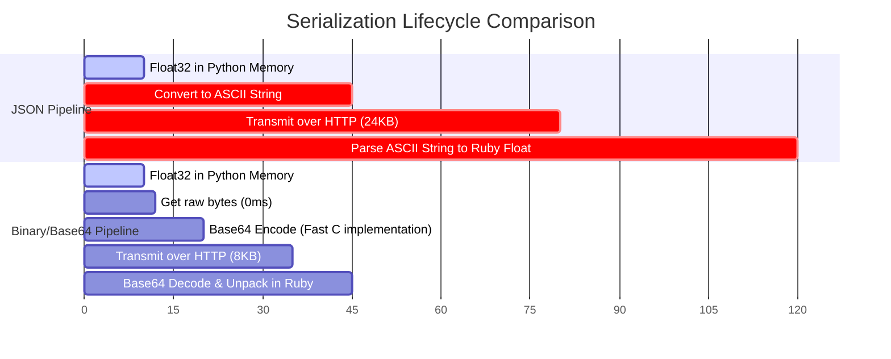

Every embedding API I've worked with sends vectors as JSON. It's convenient, but it is also one of the most expensive ways to move numerical data. 

JSON isn't expensive just because it's text. It's expensive because every floating-point value must be converted from binary to decimal, transmitted as characters, and parsed back into binary. You pay that conversion cost on every dimension of every vector, in both directions.

By replacing JSON arrays with Base64-encoded binary float buffers, we cut payload size by 75% and serialization latency by over 98%.

Here is the benchmark, measuring 1,000 embeddings at 1,536 dimensions each:

| Metric                        | JSON Float Array | Base64 Float Buffer | Improvement |
| :---------------------------- | :--------------: | :-----------------: | ----------: |
| **Payload Size**              |     120.3 MB     |       30.1 MB       |  **-75.0%** |
| **Python Serialization Time** |     3,140 ms     |        45 ms        |  **-98.5%** |
| **Ruby Deserialization Time** |     4,820 ms     |       110 ms        |  **-97.7%** |
| **Total Roundtrip Latency**   |      9.42 s      |       1.84 s        |  **-80.4%** |

> **Benchmark environment:** Ruby 3.3.4, Python 3.12, NumPy 1.26, FastAPI 0.111, Apple M3 Pro (development) and x86_64 Linux (production). Each format was measured over 1,000 iterations with GC disabled using Ruby's `Benchmark::IPS` and Python's `timeit`. Payload sizes are raw HTTP body bytes before compression.
>
> **Reproduce it yourself:** The [Python serialization and Ruby deserialization benchmark scripts](https://gist.github.com/wilburhimself/9acedeb7bc3c90606450f0db8aa070b3) are available as a Gist.

---

## Why numerical data doesn't belong in JSON

Computers don't store floats as text. In memory, a single-precision float (`float32`) is a 4-byte (32-bit) binary value. When you serialize it to JSON, you pay for conversion in both directions:

**JSON pipeline:**

```
float32 in memory (4 bytes)
    ↓  binary-to-decimal conversion
"-0.23142091" as ASCII string (11+ bytes)
    ↓  HTTP (24 KB per 1,536-dim vector)
JSON parser reads characters
    ↓  string-to-float conversion (strtof)
float in Ruby memory
```

**Binary pipeline:**

```
float32 in memory (4 bytes)
    ↓  tobytes() — zero conversion, O(1)
raw bytes
    ↓  Base64 encode (fast C implementation)
ASCII string (8 KB per 1,536-dim vector)
    ↓  HTTP
Base64 decode → unpack("e*") in Ruby
    ↓  single C pass over raw bytes
float in Ruby memory
```

In binary, a `float32` takes exactly 4 bytes. In JSON, `-0.23142091` takes 11 bytes plus separator commas—a 3x size multiplier. 

A 1,536-dimension embedding takes 6,144 bytes (~6 KB) in binary. The equivalent JSON array exceeds 24 KB. For a batch of 50 documents, you are transmitting a megabyte of text instead of 300 KB of binary.


```mermaid
gantt
    title Serialization Lifecycle Comparison
    dateFormat X
    axisFormat %s

    section JSON Pipeline
    Float32 in Python Memory      :active, j1, 0, 10
    Convert to ASCII String       :crit, j2, 10, 45
    Transmit over HTTP (24KB)     :crit, j3, 45, 80
    Parse ASCII String to Ruby Float:crit, j4, 80, 120

    section Binary/Base64 Pipeline
    Float32 in Python Memory      :active, b1, 0, 10
    Get raw bytes (0ms)           :b2, 10, 12
    Base64 Encode (Fast C implementation) :b3, 12, 20
    Transmit over HTTP (8KB)      :b4, 20, 35
    Base64 Decode & Unpack in Ruby :b5, 35, 45
```

The network payload is only part of the problem; the CPU cost is worse. To produce the JSON, Python must format each float as a string and concatenate them. Ruby must then find delimiters, allocate memory for each token, and parse the string back into a float. That work grows linearly with batch size and embedding dimensions, eventually dominating your service latency.

---

## The naive approach (and why it fails)

Here is how our original system was structured. The Python inference server returned embeddings using standard NumPy-to-list conversion:

```python
# FastAPI endpoint (Slow & Heavy)
@app.post("/v1/embeddings")
def create_embeddings(payload: RequestPayload):
    embeddings = model.encode(payload.texts) # numpy array of float32
    return {
        # This implicitly converts the numpy array to a list of Python floats,
        # which FastAPI's JSON encoder serializes to a string.
        "embeddings": embeddings.tolist()
    }
```

The Rails application consumed them using standard HTTP clients and JSON parsing:

```ruby
# Rails Client (Slow & Heavy)
class InferenceClient
  def fetch_embeddings(texts)
    response = HTTParty.post(
      "http://inference-server/v1/embeddings",
      body: { texts: texts }.to_json,
      headers: { "Content-Type" => "application/json" }
    )

    # JSON parsing allocates thousands of strings and converts them back to floats
    JSON.parse(response.body)["embeddings"]
  end
end
```

During profiling, we discovered Rails spent up to 40% of its execution time inside `JSON.parse` when processing large batches of embeddings. We were spending more CPU power parsing text than executing business logic.

---

## A better approach: binary float buffers via Base64

Rather than trying to parse JSON faster, we eliminated it entirely for the embedding vectors.

We serialize the float array as a raw binary buffer, then encode that buffer into a Base64 string. Base64 adds a 33% size overhead compared to raw binary, but it lets us embed binary data safely inside standard JSON payloads. We get binary performance without changing content-type negotiation, custom HTTP framing, or breaking standard JSON consumers.

### 1. Python Inference Server (Encoding)

Instead of calling `.tolist()`, we extract the raw bytes from the underlying C memory block:

```python
import base64
import numpy as np

def serialize_embeddings(embeddings: np.ndarray) -> str:
    # Ensure the array is single-precision float32
    float_array = embeddings.astype(np.float32)

    # Get raw C-compatible memory bytes
    raw_bytes = float_array.tobytes()

    # Base64 encode the bytes and decode to an ASCII string
    return base64.b64encode(raw_bytes).decode("ascii")
```

The response returns a single string instead of an array of numbers:

```json
{
  "embedding": "MzMzMzPz8/M+MzMzMzPz8z8zMzMz..."
}
```

### 2. Rails Application Server (Decoding)

On the Ruby side, we decode the Base64 string back into raw bytes and unpack them into Ruby Floats using `String#unpack`:

```ruby
require "base64"

class EmbeddingDecoder
  # Decodes a Base64-encoded float32 binary buffer into a Ruby array of floats
  def self.decode(base64_string)
    # 1. Decode Base64 string back to binary string (raw bytes)
    binary_data = Base64.strict_decode64(base64_string)

    # 2. Unpack the binary buffer.
    # 'e' = little-endian single-precision (32-bit) float
    # '*' = unpack all remaining data in the string
    binary_data.unpack("e*")
  end
end
```

Unlike iterating over a Ruby array, `unpack` runs entirely in optimized C inside the Ruby VM. It reads raw bytes directly from memory, offsets the pointer by 4 bytes at a time, and constructs Ruby Float objects in a single pass.

---

## Precision and endianness

When moving binary data across languages and hardware, precision and endianness are critical.

* First, watch the precision. NumPy defaults to `float64` (8 bytes), but embeddings are almost universally `float32` (4 bytes). We cast explicitly with `.astype(np.float32)` because serializing as 64-bit and unpacking as 32-bit corrupts the data.
* Second, match the endianness. We use `e*` in Ruby to explicitly unpack little-endian floats. Because our Python servers (x86 Linux) and Rails servers (macOS ARM / x86 Linux) are all little-endian, this matches native byte orders while keeping the decoding behavior explicit and portable.

---

## The trade-offs

This optimization is not a silver bullet. We evaluated several alternatives before settling on Base64 over JSON:

* We looked at Protocol Buffers and gRPC. It's the standard answer for internal services, but generating stubs and running gRPC infrastructure was too heavy for a single API endpoint. Base64 over HTTP let us ship in an afternoon with no new infrastructure.
* We considered MessagePack. It is a great binary serializer, but introducing a second codec just for the embedding field felt like overkill.
* We evaluated Apache Arrow. It's excellent for batch data, but because we write embeddings straight to pgvector, Arrow's columnar overhead wasn't worth the complexity.
* We could have used raw binary HTTP. Passing raw bytes via `application/octet-stream` saves the 33% Base64 bloat, but it breaks standard HTTP debugging and makes handling error envelopes much more complex.

### The real costs

Before committing, keep in mind:

* You lose human readability. You can't inspect raw vectors in curl or browser tools without decoding the Base64 string manually first.
* It couples your schema. Changing the model from `float32` to `float16` on the Python side requires a simultaneous update to your Ruby unpack code.
* Ruby still allocates memory. `unpack` is fast, but it still instantiates 1,536 Float objects per vector. If your database client (like pgvector) accepts binary blobs directly, you might want to skip materializing the Ruby array entirely.

---

## Text is for humans, binary is for systems

JSON won the web because it is readable. For most API endpoints, that readability is worth the minor parsing overhead.

But embeddings are different. A single vector contains more numerical data than most entire API payloads. Serializing dense float arrays as text strings mismatches the data structure to its representation.

Performance wins rarely start with algorithm tweaks. The biggest gains usually come from changing how data is represented. Once you stop treating dense numbers like text, your CPU has much less work to do.
