We love performance stories with a dramatic ending.

Someone finds the missing index.  
A single cache doubles throughput.  
One configuration change fixes everything.  

Those stories exist.

But most production systems don't become slow because of one catastrophic decision. They become slow because dozens of small inefficiencies accumulate.

Mature systems rarely waste time inside algorithms.  
They waste time moving data between algorithms.

As systems grow, the boundaries between components become the dominant source of performance loss. That is why performance improvements compound: every optimization removes friction that was limiting the value of the next one.

---

## The Hidden Cost of Boundaries

Every time data crosses a boundary—whether between functions, processes, or physical servers—you pay a tax. In modern application architectures, it is often not the computation itself that throttles the system. Instead, every boundary introduces friction:

* **Serialization** — converting data into another representation.
* **Copying** — moving bytes between runtimes or memory regions.
* **Synchronization** — waiting for another thread or process.
* **Scheduling** — context-switching execution contexts.
* **Protocol Conversion** — wrapping payloads in transport envelopes.

None of these operations is expensive enough to matter on its own. Together, they define the latency profile of modern systems.

In multi-stage systems, removing one bottleneck often increases the value of removing the next. That's why improvements frequently compound instead of adding linearly.

---

## The Multiplying Effect of Pipeline Stages

To see this compounding effect, look at a request pipeline:

```
Request Pipeline:
[Queue / Network] ➔ [Parsing / Deserialization] ➔ [Computation] ➔ [Serialization] ➔ [Network Send]
```

Imagine a request taking 100 units of time, split into **Parsing** (40 units), **Inference** (50 units), and **Network** (10 units). 

If you make the inference engine twice as fast (dropping it to 25 units), total request time drops to 75 units—a modest **25% speedup**. The 40-unit parsing bottleneck dominates the remaining cost.

Conversely, if you only optimize parsing to be 4x faster (dropping it to 10 units), total request time drops to 70 units—a 30% speedup.

But implement **both** optimizations together:
* **Original**: 40 (parsing) + 50 (inference) + 10 (network) = **100 units**
* **Optimized**: 10 (parsing) + 25 (inference) + 10 (network) = **45 units**

Individually, they reduced latency by 25% and 30%. Together, they cut latency by 55% (effectively more than doubling the system's throughput under the same hardware constraints).

```mermaid
gantt
    title Latency Breakdown (Before vs. After)
    dateFormat X
    axisFormat %s
    
    section Baseline (10s)
    Parsing (JSON)                :active, p1, 0, 40
    Inference (CPU/GPU)           :crit, i1, 40, 90
    Network Transfer              :n1, 90, 100
    
    section Optimized (4.5s)
    Parsing (Binary)              :active, p2, 0, 10
    Inference (Optimized)         :crit, i2, 10, 35
    Network Transfer              :n2, 35, 45
```



This is exactly what Amdahl's Law predicts. By removing the parsing bottleneck, you unlocked the full potential of the inference optimization. The gains compound because each optimization changes where the system spends its time, increasing the value of the next optimization.

*Every optimization changes the shape of the system. The bottleneck you measure today is rarely the one you'll measure tomorrow.*

---

## Case Study: Optimizing an Embedding Pipeline

We recently optimized an embedding inference pipeline and saw this exact phenomenon play out.

We initially assumed the model was the bottleneck. However, profiling revealed two unrelated bottlenecks:
1. **Thread Contention**: PyTorch and OpenMP were spawning 240 conflicting threads, causing the CPU scheduler to thrash.
2. **Serialization Overhead**: We were transmitting 1,536-dimensional float arrays as text-based JSON, bloating the network payload and locking up Rails CPU cycles during parsing.

In fact, the Rails process spent more CPU parsing embeddings than the model spent generating them.

Neither optimization was dramatic on its own. Together they shifted the system's limiting factor:

```
Baseline Throughput: 7.28 req/s

Step 1: Coordinate Concurrency (Set Threads to 1)
  Throughput: 7.28 req/s ➔ 11.45 req/s (1.57x speedup)

Step 2: Optimize Serialization (Base64 Binary Unpacking)
  Throughput: 11.45 req/s ➔ 13.93 req/s (1.21x speedup over Step 1)

Total Compounded Improvement:
  1.57 (concurrency factor) × 1.21 (serialization factor) = 1.90 (90% overall throughput increase)
```

Removing the parsing bottleneck didn't just reduce latency. It increased the value of every optimization behind it. Had we only focused on the model, or only on the Rails serialization code, we would have concluded that our servers were at their physical limits and paid for more expensive hardware.

---

## Systems Thinking and Bottleneck Shifting

This case study illustrates a fundamental rule of systems engineering:

> Every successful optimization invalidates your previous profile.

Optimizing components independently often fails because systems don't execute independently. If you make Component A twice as fast, but Component B is waiting on a lock, the system simply shifts the bottleneck elsewhere.

The consequence is that performance work becomes an iterative discipline.

Every optimization follows the same loop:

Observe.  
Isolate.  
Improve.  
Measure again.  

The important part isn't the optimization itself. It's that every improvement changes where the next bottleneck lives.

---

## The Senior Engineer's Reflection

Junior engineers often ask, "What's the bottleneck?"

Senior engineers ask, "Where is work being repeated?"

The difference matters because mature systems rarely fail in spectacular ways. They fail through accumulation: one unnecessary copy, one extra query, one oversized payload, one scheduler conflict. None of them is expensive enough to justify attention on its own. Together, they define the system's limits.

The first bottleneck you find is rarely the one limiting your system. It's simply the first one preventing you from seeing the next.

Performance engineering isn't about finding the biggest bottleneck. It's the disciplined removal of friction wherever work crosses boundaries. Every small improvement exposes the next bottleneck.

Mature systems rarely become dramatically faster because of one brilliant optimization. They become dramatically faster because dozens of ordinary improvements finally begin reinforcing one another.
