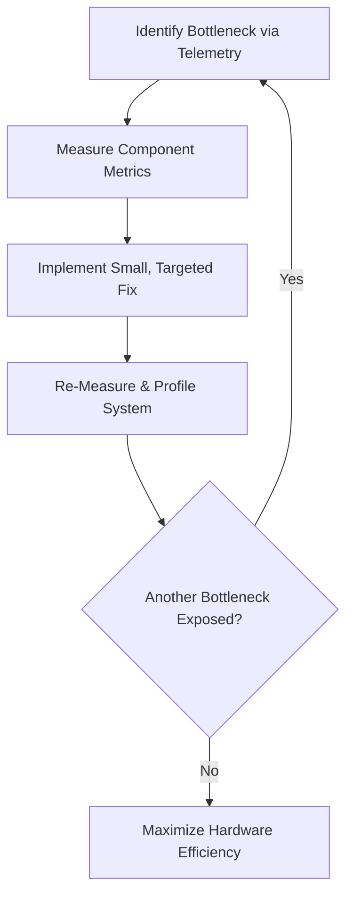

One of the most persistent myths in software engineering is the search for the **silver bullet**—the single, catastrophic bug or design flaw that, once fixed, magically makes a slow application fast. 

We love stories about the single missing database index, the one-line config change, or the misplaced loop that was holding back the system. They make performance engineering feel like detective work, culminating in a satisfying reveal.

But in real-world production systems, that is rarely how it works. 

Most software isn't slow because of one big mistake. It is slow because of the accumulation of dozens of tiny, independent inefficiencies—a phenomenon we can call "performance death by a thousand cuts."

One layer uses a slightly inefficient library default. Another serializes more data than it needs to. A third performs redundant queries. Each decision is perfectly reasonable in isolation, but together, they act as drag on the system.

Conversely, when you start optimizing these systems, you quickly discover that **performance gains compound**. A series of seemingly modest optimizations can combine to produce massive, non-linear improvements in throughput and latency.

Here is the math of compounding optimizations, and the engineering mindset required to harness it.

---

## The Multiplying Effect of Pipeline Stages

To understand why optimizations compound, we have to look at how modern web requests are processed. A typical request does not execute in a vacuum; it flows through a sequential pipeline of stages:

```
Request Pipeline:
[Queue / Network] ➔ [Parsing / Deserialization] ➔ [Computation] ➔ [Serialization] ➔ [Network Send]
```

If you have bottlenecks in multiple stages of this pipeline, optimizing just one of them will yield disappointing results. This is a direct consequence of **Amdahl's Law**, which states that the overall performance improvement of a system is limited by the fraction of time that the improved activity is actually used.

Let's look at a concrete example. Imagine a web request that takes 10 seconds to complete, broken down into three stages:
1. **Parsing (JSON)**: 4 seconds
2. **Inference (CPU/GPU)**: 5 seconds
3. **Network Transfer**: 1 second

If you spend a week rewriting the inference model and manage to make it twice as fast (a massive 50% improvement in computation time), the inference stage drops from 5 seconds to 2.5 seconds. 

However, the total request time only drops from 10 seconds to 7.5 seconds—a modest **25% overall latency reduction**. The 4-second JSON parsing bottleneck is now the dominant cost.

Now, imagine you optimize the JSON parsing stage, making it 4x faster (dropping it from 4 seconds to 1 second) by switching to a binary serialization format. 

If you *only* did this optimization, the total request time would drop from 10 seconds to 7 seconds (a 30% improvement).

But look at what happens when you implement **both** optimizations together:
* **Original**: 4s (parsing) + 5s (inference) + 1s (network) = **10 seconds**
* **With Both Optimizations**: 1s (parsing) + 2.5s (inference) + 1s (network) = **4.5 seconds**

The combination of a 50% computation improvement and a 75% parsing improvement resulted in a **55% overall speedup** (throughput more than doubled). 

As you remove one bottleneck, you unlock the full value of the other optimizations. The gains do not simply add up; they multiply.

---

## Case Study: Doubling AI Throughput

We saw this compounding effect clearly in our recent work optimizing an embedding inference pipeline. 

We had two major issues in our system:
1. **Thread Contention**: PyTorch and OpenMP were spawning 240 conflicting threads, causing the CPU scheduler to thrash.
2. **Serialization Overhead**: We were transmitting 1,536-dimensional float arrays as text-based JSON, bloating the network payload and locking up Rails CPU cycles during parsing.

If we had only optimized the threads, our throughput would have improved, but our Rails servers would still be throttled by the CPU cost of parsing massive JSON payloads. 

If we had only optimized the serialization format, our payloads would have been smaller, but the Python inference server would still be throttled by thread contention.

Instead, we optimized both. Here is how the throughput gains compounded:

```
Baseline Throughput: 7.28 req/s

Step 1: Coordinate Concurrency (Set Threads to 1)
  Throughput: 7.28 req/s ➔ 11.45 req/s (+57% Gain)

Step 2: Optimize Serialization (Base64 Binary Unpacking)
  Throughput: 11.45 req/s ➔ 13.93 req/s (+21% Gain over Step 1)

Total Compounded Improvement:
  1.57 (concurrency gain) × 1.21 (serialization gain) = 1.91 (91% overall throughput increase)
```

By addressing the bottlenecks at different stages of the system, we nearly doubled our throughput (`+91%`). 

Had we only focused on the model, or only on the Rails code, we would have concluded that our servers were at their physical limits and paid for more expensive hardware.

---

## No Magic, Just Systems

The compounding nature of performance is why the "silver bullet" mindset is so dangerous. It leads engineers to make bad trade-offs:
* **The Rewrite Trap**: Assuming the language or framework is the bottleneck, leading to costly and risky rewrites (e.g., "Rails is too slow, we must rewrite everything in Rust or Go").
* **The Infrastructure Trap**: Throwing more money at the cloud provider by upgrading instance sizes, which often fails to solve scheduler or serialization limits.
* **The Complexity Trap**: Introducing aggressive caching layers or message queues to hide latency, which adds architectural complexity and new failure modes.

Performance engineering is not magic. It is the systematic application of observation, measurement, and basic systems design. 



To harness compounding performance, you must follow a disciplined loop:

1. **Make Performance Observable**: You cannot optimize what you do not measure. Introduce granular telemetry that breaks down request execution into distinct segments (queue delay, serialization, computation, network transit). Stop looking at average latency—it hides the real bottlenecks. Look at percentiles (p95, p99) and segment durations.
2. **Minimize Coordination Overhead**: Concurrency is a resource-management problem. Minimize database locks, avoid thread contention, and keep worker pool counts aligned with physical hardware cores.
3. **Eliminate Data Translation Layers**: Keep data in its native format as long as possible. If you have binary data (like floats, images, or audio), do not translate it to text (JSON/XML) only to translate it back to binary. Use binary protocols or optimized serialization wrappers.
4. **Iterate in Small Steps**: Do not try to land five optimizations in one giant release. Change one variable, measure the impact, verify the telemetry, and then move to the next stage.

## The Senior Engineer's Takeaway

As systems grow in complexity, the boundaries between components become the primary source of performance degradation. The API contracts, the network protocols, the scheduling queues—this is where performance goes to die.

A senior performance engineer knows that the goal is not to write the fastest possible code in a vacuum. The goal is to build an observable system where components work *with* the underlying hardware and operating system, rather than fighting them.

Start small. Measure everything. Fix the boundary overheads. Watch the gains compound.
