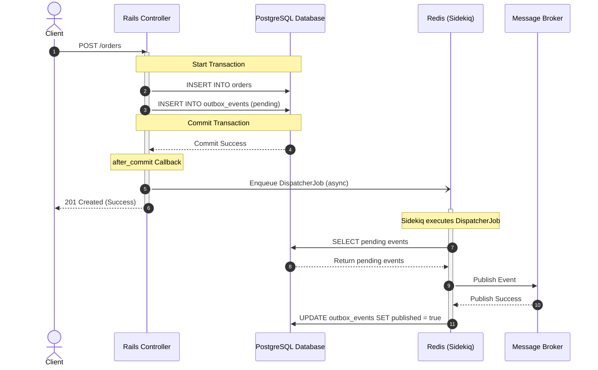

*Reliable systems don't eliminate failure. They decide where failure is allowed to happen.*

---

If you've built distributed systems long enough, you've probably written something like this:

```ruby
Order.transaction do
  order.save!
  OrderCreatedJob.perform_async(order.id)
end
```

It looks harmless.

Until one day it isn't.

Maybe Redis accepts the job but the database transaction rolls back.

Maybe the database commits but Redis is temporarily unavailable.

Maybe the process crashes in between.

Congratulations—you've discovered the dual-write problem.

The uncomfortable truth is that your application is trying to make two independent systems behave like one atomic transaction.

They never will.

In [The Outbox Pattern: Reliable Event Publishing Without Distributed Transactions](/blog/38-the-outbox-pattern-reliable-event-publishing-without-distributed-transactions/), we looked at how to solve this by using our local database as a temporary, durable message queue. But while it solves transactional consistency, it is not a silver bullet. Every engineering decision has a bill attached, and the outbox pattern is no exception.

---

## The Outbox Pattern Changes the Problem

The Outbox Pattern doesn't magically make distributed systems consistent. Instead, it changes the boundaries of consistency.

Instead of writing to both your database and an external system, you only write to one system: your database.

During the same transaction that creates the order, updates the invoice, or changes the customer record, you also insert an event into an `outbox_events` table.

Now the transaction becomes:

```text
BEGIN

INSERT orders
INSERT outbox_events

COMMIT
```

Either both records exist. Or neither does.

Only after the transaction commits does another process publish those events to Redis, Kafka, RabbitMQ, SNS, or whatever messaging infrastructure you're using.

Your database becomes the source of truth. Everything else becomes eventually consistent.

---

## Sidekiq is Not the Outbox

One misconception I see frequently is treating Sidekiq as if it solved this problem.

It doesn't.

Sidekiq solves something different. It gives you:

* Retries
* Concurrency
* Scheduling
* Backoff
* Queue management

It does **not** make Redis and PostgreSQL transactional. Those are different durability systems.

The safest architecture is to let each tool do exactly what it's good at. The Outbox guarantees durable persistence. Sidekiq guarantees reliable execution. Those responsibilities complement each other instead of overlapping.

---

## A Better Integration

The pattern I like most separates the persistence from the transport entirely. By leveraging database transaction lifecycles and asynchronous dispatchers, we achieve low latency when everything works, and durability when it doesn't.



Notice something important here.

The database transaction never blocks on or depends on Redis. If Redis is unavailable, the transaction still succeeds.

The enqueue step can fail, the dispatcher can crash, or Sidekiq can restart. None of those failures lose the event because the database already contains it. A periodic dispatcher can always recover unpublished events later.

---

## The Costs Nobody Mentions

The Outbox Pattern has become popular because it solves a painful problem. But this reliability comes with a real operational bill.

### 1. Every write becomes two writes

Without an outbox:

```sql
INSERT INTO orders ...;
```

With an outbox:

```sql
INSERT INTO orders ...;
INSERT INTO outbox_events ...;
```

You've doubled the number of writes for every event-producing transaction. That means:

* More Write-Ahead Log (WAL) generation
* More index maintenance
* More storage overhead
* More autovacuum work
* More replication traffic

For most systems, that's perfectly acceptable. But it isn't free.

### 2. The Outbox table never stops growing

Every published event leaves behind another row. Weeks later you have 12 million rows. Months later, 300 million rows.

Eventually, the outbox itself becomes infrastructure that needs maintenance. You'll need a retention strategy:

* Will you archive processed events to cold storage?
* Will you partition the outbox table by date or status?
* Will you delete processed events after a week?

Ignoring this database bloat works—until suddenly it doesn't.

### 3. Polling creates invisible database load

Most naive implementations repeatedly execute something like:

```sql
SELECT *
FROM outbox_events
WHERE published = false
LIMIT 100;
```

every second. Even when nothing has happened.

One application doing this isn't a problem. Hundreds of services doing it is. The dispatcher itself becomes part of your database workload. Good implementations use adaptive polling, batching, or PostgreSQL's `LISTEN/NOTIFY` to reduce unnecessary queries.

### 4. Ordering becomes harder

Suppose three events exist:

1. `UserCreated`
2. `UserUpdated`
3. `UserDeleted`

Now imagine two dispatchers processing them simultaneously. The consumer may observe:

1. `UserUpdated`
2. `UserCreated`
3. `UserDeleted`

The Outbox Pattern guarantees persistence. It does **not** guarantee ordering. If ordering matters, you'll need additional mechanisms such as aggregate-level sequencing or partitioned consumers.

### 5. At-least-once means duplicates

This is probably the biggest mindset shift.

Imagine the dispatcher publishes successfully... and then crashes before marking the event as published in the database. On restart, it will fetch the event and publish it again.

This isn't a bug. That's exactly how reliable delivery works.

Every consumer should therefore be idempotent. If processing the same event twice breaks your system, your consumer isn't production-ready. Sidekiq itself explicitly recommends designing jobs to be idempotent because retries and duplicate execution are expected in distributed systems.

---

## Best Practices for Outbox Implementations

If you're implementing an Outbox Pattern, these practices tend to pay for themselves quickly.

### Keep events small
Store identifiers, not entire ActiveRecord objects. Large payloads increase storage, replication traffic, serialization costs, and network overhead. Let the consumer fetch the data they need or keep events thin.

### Dispatch in batches
Publishing one event at a time doesn't scale. Publishing 10,000 at once creates long-running transactions. Most applications perform well somewhere in the 100–500 event range, though the right batch size depends on payload size and downstream latency.

### Index unpublished events
Your dispatcher almost always searches for unpublished records. Optimize that query. A partial index (e.g., `WHERE published = false`) often performs significantly better than indexing the entire table.

### Separate persistence from transport
Your Outbox should not know whether events go to Kafka, RabbitMQ, Sidekiq, SNS, or something else. Persist first, dispatch later. That separation makes your application easier to evolve.

### Monitor backlog, not just failures
Many teams alert when publishing fails. Few alert when the backlog quietly grows. A queue that keeps increasing usually indicates downstream problems long before customers notice them. As discussed in [Production Observability for Rails Outbox Pipelines](/blog/50-after-the-outbox/), metrics like queue age and depth are often better operational indicators than exception counts.

---

## Should Every Application Use It?

No.

A monolith that sends a welcome email probably doesn't need an Outbox. Neither does a CRUD application with no external integrations.

The Outbox Pattern becomes valuable when losing an event is more expensive than operating another piece of infrastructure. Payments. Inventory. Billing. Order fulfillment. Anything where silent data loss creates business problems.

Like many architectural patterns, its value depends less on technical elegance than on the cost of failure.

---

## Final Thoughts

The biggest lesson I've learned isn't that the Outbox Pattern makes systems reliable. It's that reliability always has a cost.

You can pay with distributed transactions, operational complexity, extra storage, or you can pay with occasional data loss. There isn't a free option.

The Outbox Pattern simply chooses a cost that most production systems can live with. And in my experience, that's usually the right trade.
