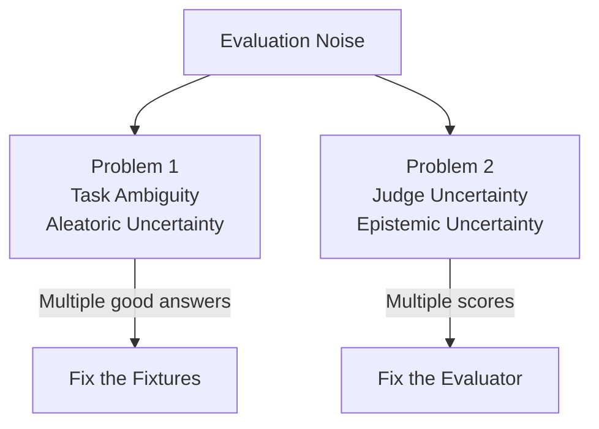

*Traditional tests are binary. LLM evaluations are a forecast.*

---

Every software engineer has experienced the satisfaction of a green test suite.

You change the code.

You run the tests.

Everything passes.

That simple feedback loop has shaped how we've built software for decades.

Then LLMs quietly broke one of software engineering's most trusted feedback loops.

You run the exact same evaluation twice...

...and get two different answers.

Nothing changed.

At least, nothing you can see.

---

## The Fallacy of the Scoreboard

> An evaluation score looks like a measurement.
>
> It isn't.
>
> It's an estimate.

This isn't entirely new. Performance benchmarks, A/B tests, and distributed systems have always required statistical thinking. LLM evaluation simply makes that reality impossible to ignore.

When we built our internal LLM evaluation framework, we expected to run our benchmarks, get a single score (say, 84%), tweak a prompt, and see that score change. If it dropped to 81%, we assumed a regression. If it rose to 87%, we assumed an improvement.

We spent weeks chasing ghosts, tweaking prompts to fix a drop in score, only to realize the next run would swing back.

The mistake isn't that LLM evaluations are noisy.

The mistake is expecting them not to be.

Once you stop thinking of evaluation as testing—and start thinking of it as measurement—the architecture almost designs itself.

To build an AI evaluation pipeline that actually guides production decisions, you must realize:

**Not all evaluation noise is the same.**

Some fluctuations come from the conversations we are evaluating. Others come from the evaluator itself.

Every score fluctuation is a question before it's an answer:

* **Did the model change?**
* **Did the benchmark change?**
* **Or did the measurement change?**

Treating all three as "the score changed" is how evaluation systems lose credibility.

---

## Problem #1: Sometimes There Isn't a Right Answer

Imagine a user who replies to your LLM assistant with a single word:

> "Stop"

What should the assistant do?
* **An SMS opt-out request:** "You have been unsubscribed."
* **A conversation pause:** "Let's stop here for today. Let me know when you want to continue."
* **Frustration:** "I'm sorry, let's try another approach."
* **A change of topic:** "Okay, let's stop talking about this and try something else."

Without additional context, all of these interpretations are reasonable. Even human reviewers will disagree on the best response. The ambiguity exists in the conversation itself. No prompt engineering or model tuning can eliminate it.

Statisticians call this **aleatoric uncertainty**.

The terminology isn't important. The engineering implication is.

If the uncertainty lives in the conversation, improving the judge won't fix it. You're optimizing the wrong part of the system. You cannot debug or code your way out of it because the input itself lacks the information required to produce a single deterministic answer.

### How to Mitigate Task Ambiguity

In practice, reducing task ambiguity usually comes down to four things:
1. **Richer conversational context:** Ensure your fixtures contain multi-turn history. Context resolves ambiguity.
2. **Production-derived fixtures:** Build your benchmark using anonymized, cleaned production logs that represent real-world usage rather than synthetic test cases.
3. **Explicit ambiguity labels:** Tag fixtures that have multiple valid responses so they aren't judged on a binary scale.
4. **Measuring fixture quality:** Track fixture fidelity and coverage instead of focusing solely on the model's score.

---

## Problem #2: Sometimes the Judge Is Wrong

Now imagine a different scenario.

You have a clean, unambiguous fixture. The candidate model produces a response that is clearly correct. You pass it to your LLM judge. The judge gives it a score of 4 out of 5.

You run the exact same evaluation five minutes later. The judge gives it a score of 5 out of 5.

Nothing in the candidate response changed, yet the score did.

Statisticians call this **epistemic uncertainty**.

Here the opposite is true. The task is stable. The measurement isn't. That means your evaluation infrastructure—not your benchmark—is what needs improvement.

Epistemic noise creeps in through:
* **Stochastic API Behavior:** Even at temperature 0, repeated calls to hosted LLM APIs can produce different outputs in practice because providers may use implementation details that are opaque to users.
* **Rubric Ambiguity:** If your prompt asks the judge, *"Is this response helpful?"*, the judge is forced to invent its own definition of "helpful" on every run.
* **Model Biases:** LLMs exhibit self-preference (favoring their own text), position bias (preferring the first option), and length bias (favoring longer responses).

### How to Mitigate Judge Uncertainty

In practice, hardening your evaluation framework against judge uncertainty comes down to:
1. **Judge ensembling:** If evaluation results influence production decisions, judge ensembling can substantially improve robustness. Run evaluations across multiple models (e.g., Claude, GPT-4, Gemini) to smooth out model-specific blind spots.
2. **Measuring inter-judge agreement:** Track agreement rates (like Cohen’s Kappa) to identify when judges diverge.
3. **Tracking judge variance:** Periodically run the exact same input through your judges multiple times to calculate your evaluation system's baseline standard deviation. If your benchmark reports a model score of 84%, the most useful number may not be 84. It may be **84% ± 3%**.
4. **Multi-axis scoring:** Score along distinct, objective axes (e.g., correctness, safety, conciseness) using binary or highly structured scales instead of subjective 1-to-5 ranges.
5. **Flagging judge-sensitive fixtures:** Automatically flag fixtures that show unusually high score variance across runs for manual auditing.

---

## Why This Matters

This distinction shapes the architecture of your evaluation system. If you don't know which type of noise you are dealing with, you will make the wrong engineering trade-offs. Spending weeks tweaking a prompt to evaluate an inherently ambiguous fixture is a waste of time.

Once we started thinking about uncertainty this way, several architectural decisions became obvious:

* **Fixture Audits** reduced task ambiguity by improving realism, coverage, and multi-turn representation.
* **Multi-Axis Scoring** made disagreements explainable by separating quality dimensions rather than collapsing everything into a single score.
* **Judge Ensembling** reduced judge uncertainty by comparing independent evaluators.
* **Confidence Reporting** allowed us to distinguish genuine regressions from expected evaluation variance.
* **Coverage Metrics** communicated the statistical confidence of the evaluation itself.

---

## Moving Beyond the Scoreboard

Traditional testing is about proving correctness.

LLM evaluation is about estimating confidence.

That distinction changes everything. It changes how we write fixtures, design judges, and interpret regressions. Most importantly, it changes what a successful evaluation system looks like.

Reliable evaluation isn't about removing uncertainty.

It's about understanding it well enough to make better engineering decisions.

As LLM systems become more capable, our evaluation systems will need to become more sophisticated as well. The challenge is no longer simply measuring quality—it's measuring how confident we should be in the measurement itself. Once you embrace that shift, evaluation stops being a scoreboard and starts becoming a decision-making tool.
